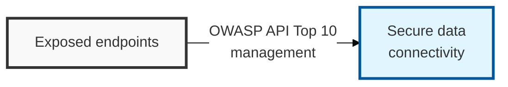

## I. Overview

**Definition**: API security refers to the technologies and processes that protect the API interfaces supporting interaction between applications from unauthorized access, data leakage, and availability breaches.

**Features**:  
( **Data-Centric Communication** ) Unlike traditional web (HTML), interaction is centered on structured data such as JSON and XML.  
( **Broad Attack Surface** ) Numerous endpoints are exposed externally, requiring sophisticated authorization control and business-logic protection.  
( **Statelessness** ) Because each request is processed independently, strong token-based authentication and authorization mechanisms are required.

## II. Mechanism & Components

### A. BOLA (API 01): The Core API Security Threat

**Concept**: A vulnerability that occurs when a user includes the ID of an object that does not belong to them in a request, and the server fails to properly verify authorization for that resource.

**Attack Scenario**: When calling `/api/v1/user/1001/profile`, changing `1001` to `1002` to obtain another user's information (a form of IDOR).

**Countermeasure**: Implement horizontal authorization checks that compare session information against object ownership for every object access.

### B. Key Items in the OWASP API Security Top 10

| Rank | Item | Description |
|:---:|----------|----------|
| **API 01** | **BOLA** | Insufficient object-level authorization checks (the most frequent vulnerability) |
| **API 02** | **Broken Authentication** | Exposed authentication tokens, weak password policies, absent session management |
| **API 03** | **BOPLA** | Insufficient object-property-level authorization (exposure of sensitive fields) |
| **API 04** | **Unrestricted Resource Consumption** | Exposure to DoS attacks due to the absence of rate limiting |
| **API 05** | **Broken Function Level Auth** | A regular user is able to call administrator-only API endpoints |

## III. Comparison & Application

| Comparison | OWASP Web Top 10 | OWASP API Security Top 10 |
|----------|------------------|---------------------------|
| Primary Target | Traditional browser-based web applications | Mobile, MSA, and IoT-based API endpoints |
| Main Attacks | SQL Injection, XSS (targeting the browser) | BOLA, excessive data exposure (business logic) |
| Security Focus | Input validation and browser security | Authorization control and traffic governance |
| Defense System | WAF (Web Application Firewall) | API Gateway, WAAP (Web App & API Protection) |

A WAF tuned for the OWASP Web Top 10 will not catch BOLA, because the request itself is syntactically valid — the flaw is entirely in business logic, not input format. Teams that assume their existing WAF covers API traffic are the ones still finding BOLA in production; the practical takeaway is that API endpoints need an API Gateway or WAAP layer doing object-level authorization checks in addition to, not instead of, traditional perimeter defenses.
