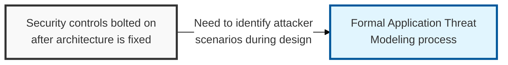
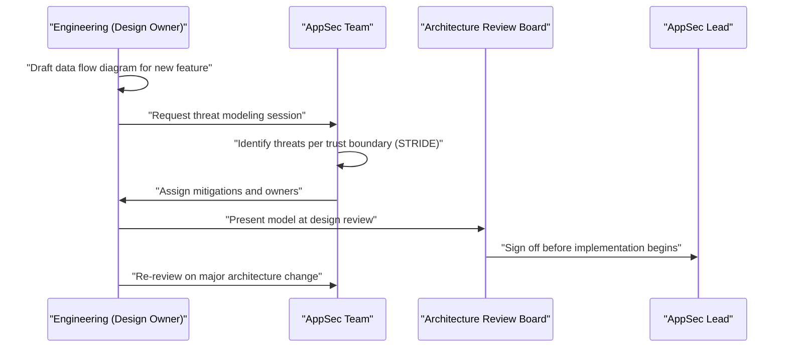

## I. Overview

**Definition**: An Application Threat Modeling document captures the structured analysis of a system's attack surface — its trust boundaries, data flows, and the ways an attacker could abuse each one — performed before or during design, rather than after the code is written.

**Features**:  
( **Ownership** ) Produced collaboratively by the application's engineering team and AppSec.  
( **Taxonomy** ) Typically uses a frame like **STRIDE** (Spoofing, Tampering, Repudiation, Information Disclosure, Denial of Service, Elevation of Privilege).  
( **Design-Time Rationale** ) Exists because security controls chosen after architecture is fixed are patches, not design decisions.  
( **Proactive Defense** ) Lets a team decide what to build defensively in the first place instead of retrofitting defenses onto a shipped system.

## II. Structure & Process

| Field | Description |
|---|---|
| System / Feature | Component or feature being modeled, with a data flow diagram reference |
| Trust Boundary | Point where data crosses between differently-trusted zones (e.g. client to API, service to database) |
| Threat | Specific attacker scenario, categorized by **STRIDE** or an equivalent taxonomy |
| Likelihood / Impact | Qualitative or scored assessment of risk |
| Mitigation | Control that addresses the threat, e.g. input validation, authentication, encryption |
| Status | **Identified**, **Mitigation Planned**, **Mitigated**, or **Accepted Risk** |
| Reviewer | AppSec representative who validated the model |

Threat modeling is performed at design time for any new system or major feature, and re-run whenever a trust boundary changes; AppSec reviews the model at each architecture review gate.

## III. Best Practices & Comparison

| Document | Primary Purpose | Update Cadence | Owner |
|---|---|---|---|
| Application Threat Modeling | Identify design-time attacker scenarios before implementation | At design and on major change | Engineering + AppSec |
| [Secure Coding Checklist](../secure-coding-checklist/) | Implementation-time control derived from threat model mitigations | Per pull request | AppSec + Engineering |
| [Web Application Vulnerability Tracker](../web-application-vulnerability-tracker/) | Confirms whether threat model mitigations held up under real testing | Per scan / pentest cycle | AppSec |

- Model the system before code is written, not as a retrospective exercise after launch.
- Diagram every trust boundary explicitly — most missed threats live at boundaries no one drew.
- Use a consistent taxonomy (STRIDE or equivalent) so threats across different systems remain comparable.
- Assign a concrete owner and mitigation to every identified threat; an unowned threat is not actually mitigated.
- Revisit the model whenever authentication, data flow, or a trust boundary changes, not only on a fixed schedule.

Related: [Secure Coding Checklist](../secure-coding-checklist/), [Web Application Vulnerability Tracker](../web-application-vulnerability-tracker/)
