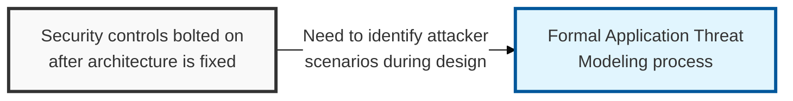
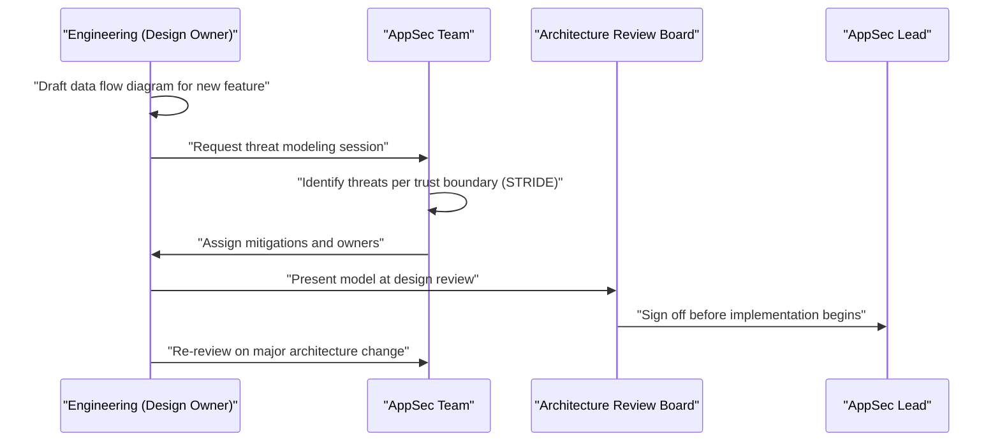

## I. Overview

**Definition**: An Application Threat Modeling document captures the structured analysis of a system's attack surface — its trust boundaries, data flows, and the ways an attacker could abuse each one — performed before or during design, rather than after the code is written.

**Features**:  
( **Ownership** ) Produced collaboratively by the application's engineering team and AppSec.  
( **Taxonomy** ) Typically uses a frame like **STRIDE** (Spoofing, Tampering, Repudiation, Information Disclosure, Denial of Service, Elevation of Privilege).  
( **Design-Time Rationale** ) Exists because security controls chosen after architecture is fixed are patches, not design decisions.  
( **Proactive Defense** ) Lets a team decide what to build defensively in the first place instead of retrofitting defenses onto a shipped system.

## II. Structure & Process

| Field | Description |
|---|---|
| System / Feature | Component or feature being modeled, with a data flow diagram reference |
| Trust Boundary | Point where data crosses between differently-trusted zones (e.g. client to API, service to database) |
| Threat | Specific attacker scenario, categorized by **STRIDE** or an equivalent taxonomy |
| Likelihood / Impact | Qualitative or scored assessment of risk |
| Mitigation | Control that addresses the threat, e.g. input validation, authentication, encryption |
| Status | **Identified**, **Mitigation Planned**, **Mitigated**, or **Accepted Risk** |
| Reviewer | AppSec representative who validated the model |

Threat modeling is performed at design time for any new system or major feature, and re-run whenever a trust boundary changes; AppSec reviews the model at each architecture review gate.

## III. Expected Benefits & Implications

Application Threat Modeling pays off before a line of code ships — its real value is turning "we think this is secure" into a documented, reviewable claim about specific trust boundaries, rather than a vague assurance from whoever built the feature. Measure its success by how many mitigations get designed in from the start, not by how many threat models get produced; a model that never influences the architecture is paperwork, not risk reduction.

| Benefit | Where It Shows Up |
|---|---|
| Cheaper fixes | Design changes cost far less than post-launch patches or incident response |
| Traceable ownership | Every threat has an assigned mitigation and owner, not a diffuse "someone should handle this" |
| Faster security review | AppSec reviews a documented model instead of reverse-engineering trust boundaries from code |

Related: [Secure Coding Checklist](../secure-coding-checklist/), [Web Application Vulnerability Tracker](../web-application-vulnerability-tracker/)
