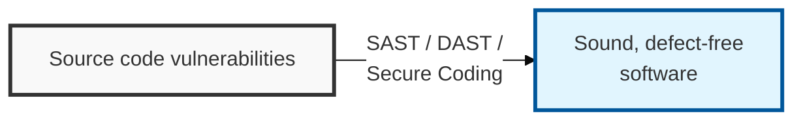
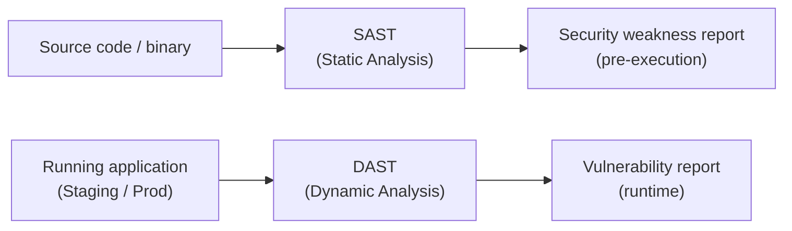

## I. Overview

**Definition**: Code security is the practice of analyzing the security weaknesses that can arise during software development and applying safe coding standards to build software free of vulnerabilities.

**Features**:  
( **Cost Reduction** ) Removing security weaknesses at the early development stage minimizes the cost of fixing them after release.  
( **Proactive Defense** ) Preemptively blocks well-known major vulnerabilities and attack techniques such as the OWASP Top 10.  
( **Software Trustworthiness** ) Builds security into the software itself through adherence to safe coding standards.

## II. Mechanism & Components

### A. Analysis Architecture: SAST vs. DAST

> **Key Point**: The two approaches are distinguished as the **white-box** method (SAST), which analyzes source code directly, and the **black-box** method (DAST), which attempts attacks against a live, running system.

### B. SAST vs. DAST Key Comparison

| Comparison | Static Analysis (SAST) | Dynamic Analysis (DAST) |
|----------|----------------|----------------|
| Analysis Target | Source code, binary (pre-execution) | Running application (during execution) |
| Analysis Method | White-box | Black-box |
| Timing | Development (Implementation) stage | Testing/Production (Staging/Prod) stage |
| Detects | Syntax errors, secure-coding violations, logic errors | Runtime vulnerabilities, authentication errors, session management flaws |
| Advantages | Early detection (Shift-Left), root-cause identification | Verification against a real attack environment, low false-positive rate |
| Disadvantages | High false-positive rate, requires a build | Cannot pinpoint location in source code, remediation happens after the fact |

## III. Advanced Topics & Comparison

### Secure Coding Guidelines (the 7 Self-Assessment Categories from Korea's Ministry of the Interior and Safety)

The software security weakness diagnosis guide published by Korea's Ministry of the Interior and Safety is organized around the following 7 areas.

| Area | Key Inspection Content | Countermeasure (Example) |
|:---:|--------------|-----------------|
| 1. **Input Data Validation and Representation** | SQL injection, XSS, path manipulation | Use Prepared Statements, filter input values |
| 2. **Security Features** | Authentication/authorization weaknesses, weak encryption | Multi-factor authentication (2FA), strong hash algorithms (SHA-256+) |
| 3. **Time and State** | Race conditions, non-terminating loops | Synchronize shared resources, ensure proper resource release |
| 4. **Error Handling** | System information exposure, improper exception handling | Apply custom error pages, hide detailed logs |
| 5. **Code Errors** | Null pointer dereference, improper resource release | Add null checks, close resources in `finally` blocks |
| 6. **Encapsulation** | Debug code left in place, information exposure | Prevent system information exposure, avoid public fields |
| 7. **API Misuse** | Insecure API calls, use of unsafe functions | Use recommended standard libraries and APIs |
