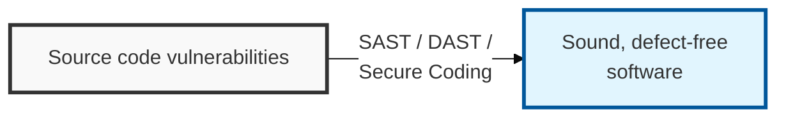
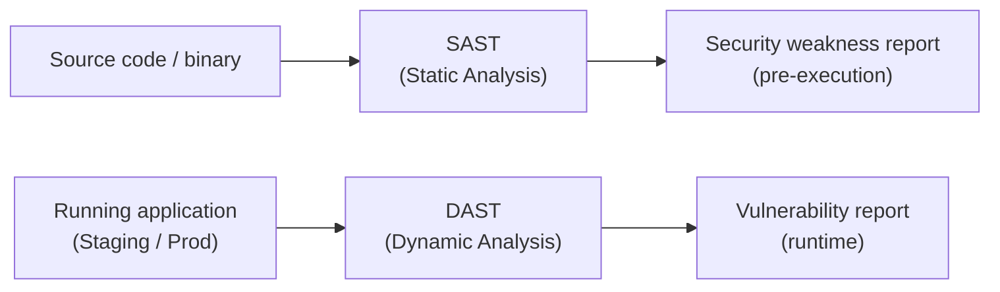

## I. Overview

**Definition**: Code security is the practice of analyzing the security weaknesses that can arise during software development and applying safe coding standards to build software free of vulnerabilities.

**Features**:  
( **Cost Reduction** ) Removing security weaknesses at the early development stage minimizes the cost of fixing them after release.  
( **Proactive Defense** ) Preemptively blocks well-known major vulnerabilities and attack techniques such as the OWASP Top 10.  
( **Software Trustworthiness** ) Builds security into the software itself through adherence to safe coding standards.

## II. Mechanism & Components

### A. Analysis Architecture: SAST vs. DAST

> **Key Point**: The two approaches are distinguished as the **white-box** method (SAST), which analyzes source code directly, and the **black-box** method (DAST), which attempts attacks against a live, running system.

### B. SAST vs. DAST Key Comparison

| Comparison | Static Analysis (SAST) | Dynamic Analysis (DAST) |
|----------|----------------|----------------|
| Analysis Target | Source code, binary (pre-execution) | Running application (during execution) |
| Analysis Method | White-box | Black-box |
| Timing | Development (Implementation) stage | Testing/Production (Staging/Prod) stage |
| Detects | Syntax errors, secure-coding violations, logic errors | Runtime vulnerabilities, authentication errors, session management flaws |
| Advantages | Early detection (Shift-Left), root-cause identification | Verification against a real attack environment, low false-positive rate |
| Disadvantages | High false-positive rate, requires a build | Cannot pinpoint location in source code, remediation happens after the fact |

## III. Vulnerabilities & Security Measures

| Weakness Area | Representative Risk | Primary Control |
|:---:|--------------|-----------------|
| Input Data Validation | SQL injection, XSS, path manipulation | Prepared Statements, whitelist input filtering |
| Security Features | Weak authentication, weak encryption | Multi-factor authentication, SHA-256+ hashing |
| Time and State | Race conditions | Synchronized access to shared resources |
| Error Handling | System information exposure | Custom error pages, no detailed logs in responses |
| Code Errors | Null pointer dereference, leaked resources | Null checks, `finally`-block resource release |
| Encapsulation | Debug code and internal data left exposed | No public fields, no system info exposure |
| API Misuse | Unsafe function and API calls | Recommended standard libraries only |

The seven categories exist because "write secure code" is not an actionable instruction — a scanner can only enforce a checklist, not a philosophy. The highest-leverage category to enforce first is Input Data Validation: it accounts for the largest share of exploitable findings in practice, and unlike Time-and-State or Encapsulation issues, it is the one category SAST tools catch with the fewest false positives.
