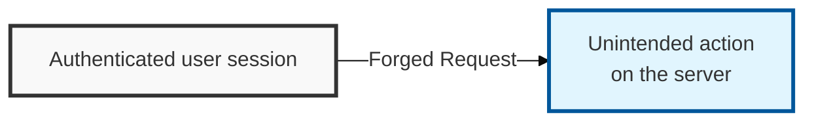
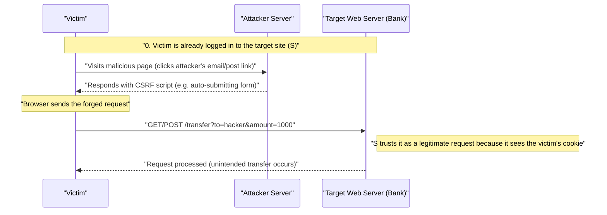

## I. Overview

**Definition**: CSRF (Cross-Site Request Forgery) is an attack technique that makes a user's browser send a request an attacker has designed — to modify, delete, or register data — to a specific website, without the user's knowledge or intent.

**Features**:  
( **Reliance on Session Trust** ) The user must already be logged in to the target site so that a valid session cookie exists in the browser.  
( **Requires User Interaction** ) The victim must click an attacker-crafted malicious link or visit a page where a script executes.  
( **Predictable Parameters** ) The attacker must be able to know the target server's request parameter structure in advance in order to forge it.

## II. Mechanism & Components

### A. CSRF Attack Scenario Process

### B. Key Comparison: CSRF vs. XSS

| Comparison | XSS (Cross-Site Scripting) | CSRF (Cross-Site Request Forgery) |
|:---:|---------------------------|----------------------------------|
| **Target** | Client (user's browser) | Server (web application service) |
| **Attack Principle** | Execution of a malicious script | Hijacking of the user's privileges (sending a forged request) |
| **Core Goal** | Information theft (cookies, sessions, etc.) | State change (modifying, deleting data, transferring funds, etc.) |
| **Point of Action** | Data processing inside the user's browser | Business logic executed on the server side |

## III. Advanced Topics & Comparison

### A. Technical Countermeasures (Secure Coding)

- **Use of CSRF Tokens**: For every write operation ( **POST**, **PUT**, **DELETE**, etc.), validate a one-time token issued by the server to detect forgery.
- **SameSite Cookie Setting**: Apply `SameSite=Lax` or `Strict` to the cookie attribute to block automatic cookie transmission from third-party sites.
- **Double Submit Cookie**: The server compares the client's cookie value against the token value in the request parameters — useful in environments where session management is difficult.

### B. Additional Security Controls

| Control Area | Detailed Measure | Security Effect |
|----------|----------|----------|
| **Stronger Authentication** | Require re-entry of a password or an **OTP** before executing sensitive functions | Blocks final approval even if a forged request reaches the server |
| **Referer Check** | Verify the **HTTP Referer** header to confirm the request originates from an allowed domain | Detects abnormal inflow from third-party sites |
| **HTTP Method** | Design so **GET** is used only for reads and **POST** only for state changes | Defends against simple **GET**-based **CSRF** carried out via **IMG** tags, etc. |

> **Key Point**: The strongest defense against **CSRF** is a layered defense that combines **CSRF token** validation with **SameSite** cookie settings.
