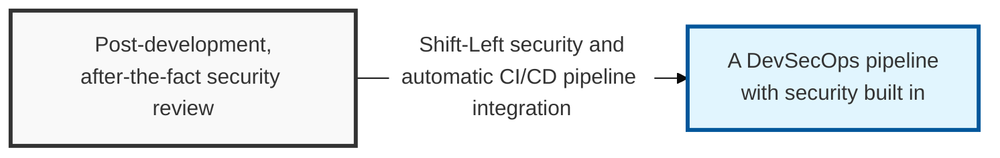
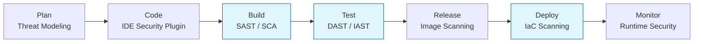

## I. Overview

**Definition**: A DevSecOps pipeline is a **CI/CD** pipeline that automates and integrates security activities across the entire software development lifecycle ( **SDLC** ) — a modern development framework that secures both speed and security at the same time.

**Features**:  
( **Shift-Left** ) Applies security from the earliest stage of development ( **Shift-Left** ), reducing remediation cost and improving quality.  
( **Continuous Security Verification** ) Identifies and blocks threats in real time through automated security tooling at every stage of build, test, and deployment.  
( **Collaborative Culture** ) Builds a shared-responsibility model across the Development ( **Dev** ), Security ( **Sec** ), and Operations ( **Ops** ) teams.  
( **Compliance Automation** ) Automatically verifies adherence to security policy as code ( **Policy as Code** ), streamlining regulatory response.

## II. Mechanism & Components

### A. Stage-by-Stage Security Integration Architecture

### B. Key Security Techniques and Major Tools by Pipeline Stage

| Pipeline Stage | Core Security Activity | Example Tools |
|:---:|--------------|--------------|
| **Plan / Design** | Threat modeling, defining security requirements | **OWASP Threat Dragon**, **Microsoft TMT** |
| **Commit / Code** | Real-time **IDE** inspection, secret detection | **Snyk**, **GitLeaks**, **Pre-commit hooks** |
| **Build / CI** | Static analysis ( **SAST** ), open-source analysis ( **SCA** ) | **SonarQube**, **Checkmarx**, **OWASP Dependency-Check** |
| **Test** | Dynamic analysis ( **DAST** ), interactive analysis ( **IAST** ) | **OWASP ZAP**, **Burp Suite Enterprise**, **Contrast Security** |
| **Deploy / CD** | **IaC** security scanning, container image scanning | **Terraform Compliance**, **Trivy**, **Clair** |
| **Operate / Monitor** | Runtime security, visibility, incident response | **Falco**, **ELK Stack**, **WAF**, **RASP** |

## III. Comparison & Application

| Comparison | SAST (Static) | DAST (Dynamic) | SCA (Software Composition) |
|:---:|--------------|---------------|---------------------------|
| **Analysis Target** | Source code, binary (internal) | Running application (external) | Open-source libraries, dependencies |
| **Timing** | Build stage (early) | Test/Staging stage (later) | Across the build and deploy stages |
| **Primary Goal** | Discover logic defects in code | Detect runtime vulnerabilities and configuration errors | Manage vulnerable libraries and licenses |
| **Accuracy** | High potential for false positives ( **FP** ) | Accurate since it confirms real attack paths | Accurate, based on an established database |

These three are not competing tools to choose between — they are complementary layers, and the actual design decision is sequencing and gating, not selection. Run SCA and SAST at commit time because they are cheap and catch the highest volume of issues early; save DAST for staging, where it earns its cost by confirming which of those findings are actually reachable and exploitable in a running system. A pipeline that only gates on DAST results has already shipped every SAST-catchable defect to a later, more expensive stage.
