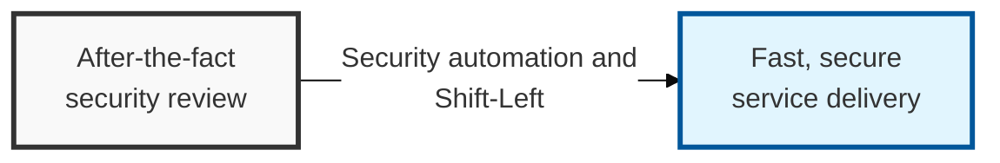

## I. Overview

**Definition**: DevSecOps is a culture and methodology that treats security as a shared responsibility by automating and integrating security activities across the entire software development lifecycle (SDLC).

**Features**:  
( **Early Detection** ) Moves security review to the early stage of development to identify defects early (Shift-Left).  
( **Automation Integration** ) Integrates security scanning and validation into the CI/CD pipeline to prevent human error.  
( **Shared Responsibility** ) Shifts security from being the job of a specific team to a shared responsibility across the Development / Operations / Security teams.

## II. Mechanism & Components

### A. Security Activities and Automation Tools by CI/CD Pipeline Stage

| SDLC Stage | Key Security Activity | Automation Technology / Tools |
|:---:|-----------------------------------|-------------------|
| **Plan** / **Design** | Threat modeling, defining security requirements | ThreatModeler, IriusRisk |
| **Code** / **Commit** | Static source code analysis, secure-coding compliance checks | SAST (SonarQube), Secrets scanning |
| **Build** / **Test** | Open-source library analysis, container image scanning | SCA (Snyk, Black Duck), SBOM generation |
| **Deploy** / **Release** | Infrastructure misconfiguration validation, dynamic analysis | IaC scanning (Checkov), DAST (ZAP) |
| **Operate** / **Monitor** | Real-time threat detection and runtime protection | SIEM, RASP, CSPM, CWPP |

### B. Key Mechanisms for Implementing Shift-Left

- **Security Gates**: Quality gates defined at each stage that automatically halt deployment when a defined security threshold is not met.
- **Policy as Code (PaC)**: Manages security policy as code so it is validated and applied consistently throughout the pipeline.
- **Automated Feedback Loops**: Delivers discovered vulnerabilities to developers in real time (e.g. via an IDE plugin) to drive immediate remediation.

## III. Expected Benefits & Implications

Adopting DevSecOps is a resourcing decision before it is a tooling decision — the benefit does not materialize just because SAST and DAST scanners are wired into CI. It shows up only once security findings have an owner with the authority and time to act on them inside the same sprint they are found, which is a Development/Operations org-design question, not a security one.

| Benefit | Practical Implication |
|---|---|
| Lower remediation cost | Fixing a design flaw pre-release is far cheaper than a post-incident patch |
| Faster release cadence | Automated gates replace a manual review bottleneck before deployment |
| Reduced audit burden | Policy as code produces continuous compliance evidence instead of a point-in-time audit scramble |

The teams that struggle with DevSecOps almost never fail at the automation — they fail at the shared-responsibility part, treating security findings as a queue for a separate team instead of a normal part of the sprint.
