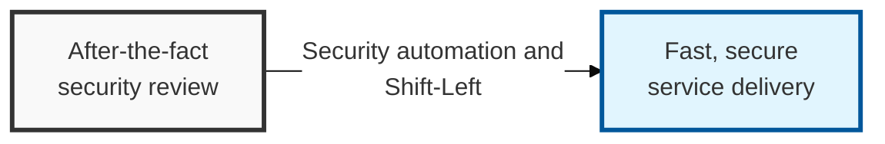

## I. Overview

**Definition**: DevSecOps is a culture and methodology that treats security as a shared responsibility by automating and integrating security activities across the entire software development lifecycle (SDLC).

**Features**:  
( **Early Detection** ) Moves security review to the early stage of development to identify defects early (Shift-Left).  
( **Automation Integration** ) Integrates security scanning and validation into the CI/CD pipeline to prevent human error.  
( **Shared Responsibility** ) Shifts security from being the job of a specific team to a shared responsibility across the Development / Operations / Security teams.

## II. Mechanism & Components

### A. Security Activities and Automation Tools by CI/CD Pipeline Stage

| SDLC Stage | Key Security Activity | Automation Technology / Tools |
|:---:|-----------------------------------|-------------------|
| **Plan** / **Design** | Threat modeling, defining security requirements | ThreatModeler, IriusRisk |
| **Code** / **Commit** | Static source code analysis, secure-coding compliance checks | SAST (SonarQube), Secrets scanning |
| **Build** / **Test** | Open-source library analysis, container image scanning | SCA (Snyk, Black Duck), SBOM generation |
| **Deploy** / **Release** | Infrastructure misconfiguration validation, dynamic analysis | IaC scanning (Checkov), DAST (ZAP) |
| **Operate** / **Monitor** | Real-time threat detection and runtime protection | SIEM, RASP, CSPM, CWPP |

### B. Key Mechanisms for Implementing Shift-Left

- **Security Gates**: Quality gates defined at each stage that automatically halt deployment when a defined security threshold is not met.
- **Policy as Code (PaC)**: Manages security policy as code so it is validated and applied consistently throughout the pipeline.
- **Automated Feedback Loops**: Delivers discovered vulnerabilities to developers in real time (e.g. via an IDE plugin) to drive immediate remediation.

## III. Advanced Topics & Comparison

### DevSecOps vs. Traditional Security Model

| Comparison | Traditional Security Model | DevSecOps (Shift-Left) |
|----------|----------------|------------------------|
| Timing of Security Activity | After development is complete, right before deployment (one-time) | Continuously integrated throughout the entire process |
| Responsible Party | A separate security team (silo) | Shared responsibility across Development/Operations/Security |
| Method | Manual review and report-driven | Automated tools and pipeline-based |
| Response Speed to Change | Slow (security review creates a bottleneck) | Fast (bottleneck removed through automated validation) |
