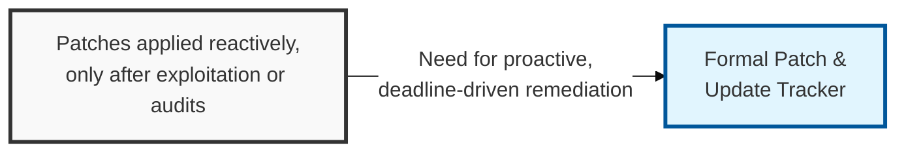
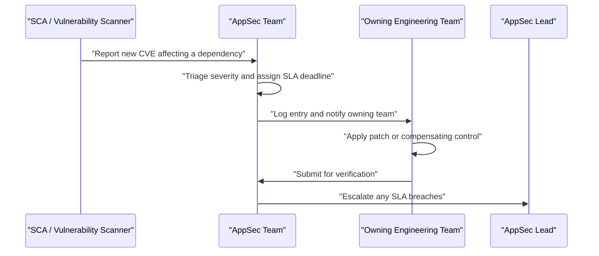

## I. Overview

**Definition**: A Patch & Update Tracker is the document that inventories every application, framework, and third-party library a team owns, alongside the patches or version updates available for each, their severity, and the deadline by which they must be applied.

**Features**:  
( **Ownership** ) Maintained by the AppSec team in coordination with the engineering teams that own each codebase.  
( **Risk Rationale** ) Exists because unpatched software — not novel zero-days — is the vulnerability class attackers exploit most reliably.  
( **Reactive Failure Mode** ) Without a tracker, patching becomes reactive, with fixes shipping only after an incident or an external scan flags a known **CVE** (Common Vulnerabilities and Exposures).  
( **Prevents Neglect** ) Surfaces issues that would otherwise sit unaddressed for months.

## II. Structure & Process

| Field | Description |
|---|---|
| Component | Application, service, framework, or library affected, with current version |
| Vulnerability / CVE ID | Identifier of the known weakness, sourced from vendor advisories, NVD, or an SCA tool |
| Severity | Risk rating, typically **CVSS** score plus exploitability context (e.g. actively exploited in the wild) |
| Patched Version | Version that resolves the issue |
| Remediation Deadline | SLA-driven date by which the patch must be applied, based on severity |
| Status | **Open**, **Scheduled**, **In Progress**, **Verified**, or **Risk Accepted** |
| Owning Team | Engineering team responsible for applying and validating the patch |
| Compensating Control | Interim mitigation (WAF rule, feature flag, network restriction) if the patch cannot be applied immediately |

New entries are logged continuously as scanners and vendor advisories surface issues; the tracker itself is reviewed weekly by the AppSec team and audited monthly for SLA compliance.

## III. Best Practices & Comparison

| Document | Primary Purpose | Update Cadence | Owner |
|---|---|---|---|
| Patch & Update Tracker | Track known-vulnerability remediation across owned software | Continuous, weekly review | AppSec Team |
| [Static Code Analysis Log](../static-code-analysis-log/) | Catch new coding weaknesses before they ship | Per build / commit | AppSec + Engineering |
| [Security Misconfiguration Log](../security-misconfiguration-log/) | Track hardening gaps, not code or dependency flaws | Per deployment / audit | AppSec + Ops |

- Tie remediation deadlines to severity-based SLAs (e.g. critical within 72 hours, high within 2 weeks) and enforce them.
- Feed the tracker directly from SCA and container-scanning tools rather than manual entry to avoid gaps.
- Require an explicit, time-boxed risk acceptance with compensating controls for any deadline that cannot be met.
- Track transitive (indirect) dependencies, not just direct ones — they are the most common source of missed patches.
- Reconcile the tracker against production inventory regularly so shadow or forgotten services are not left unpatched.

Related: [Static Code Analysis Log](../static-code-analysis-log/), [Security Misconfiguration Log](../security-misconfiguration-log/)
