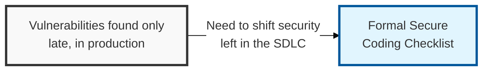
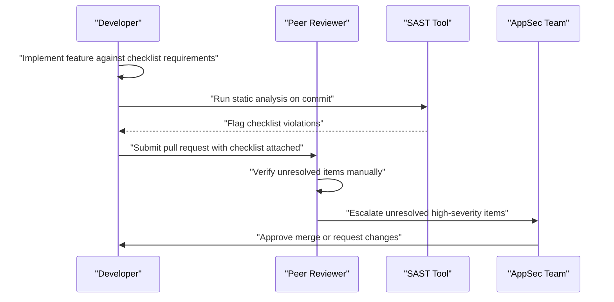

## I. Overview

**Definition**: A Secure Coding Checklist is the standardized set of requirements developers verify before code is merged or released — covering input validation, output encoding, authentication and session handling, and safe use of database and file-system APIs.

**Features**:  
( **Ownership** ) Maintained by the AppSec team and applied by engineering during development and code review.  
( **Why Needed** ) Vulnerability classes like **SQL injection**, **XSS** (Cross-Site Scripting), and **CSRF** (Cross-Site Request Forgery) are well understood and well documented, yet still ship into production when developers have no standard to check against.  
( **Concrete Gate** ) Turns "know the OWASP Top 10" into a concrete, auditable per-release gate.

## II. Structure & Process

| Field | Description |
|---|---|
| Category | Weakness class covered, e.g. **Input Validation**, **Authentication**, **Session Management**, **Output Encoding** |
| Requirement | Specific, testable rule (e.g. "use parameterized queries, never string-concatenated SQL") |
| Applies To | Language, framework, or component the rule targets |
| Verification Method | How compliance is confirmed — code review, SAST rule, or manual test |
| Severity if Violated | Impact rating used to decide whether a violation blocks release |
| Reference | Link to the underlying standard, e.g. **OWASP ASVS** (Application Security Verification Standard) control ID |
| Sign-off | Reviewer and date confirming the checklist was completed for the release |

The checklist is applied on every pull request and re-validated at release time; AppSec updates the requirement set quarterly as new weakness classes emerge.

## III. Best Practices & Comparison

| Document | Primary Purpose | Update Cadence | Owner |
|---|---|---|---|
| Secure Coding Checklist | Prevent known weakness classes during development | Per pull request | AppSec + Engineering |
| [Static Code Analysis Log](../static-code-analysis-log/) | Automated detection of violations already in code | Per build / commit | AppSec + Engineering |
| OWASP ASVS | Comprehensive verification standard the checklist is derived from | On standard revision | AppSec |
| [Web Application Vulnerability Tracker](../web-application-vulnerability-tracker/) | Track exploitable findings after code is deployed | Per scan / pentest cycle | AppSec |

- Derive checklist items from OWASP ASVS or an equivalent standard rather than inventing rules ad hoc.
- Require parameterized queries and ORM-safe data access as a non-negotiable rule for all database interaction.
- Mandate output encoding at every point untrusted data reaches HTML, JavaScript, or a URL context to prevent XSS.
- Pair the checklist with automated SAST rules so common violations are caught before human review.
- Revisit the checklist whenever a new vulnerability class is discovered in production, and add a corresponding rule.

Related: [Static Code Analysis Log](../static-code-analysis-log/), [Web Application Vulnerability Tracker](../web-application-vulnerability-tracker/)
