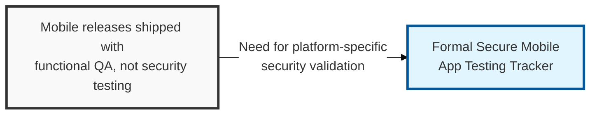
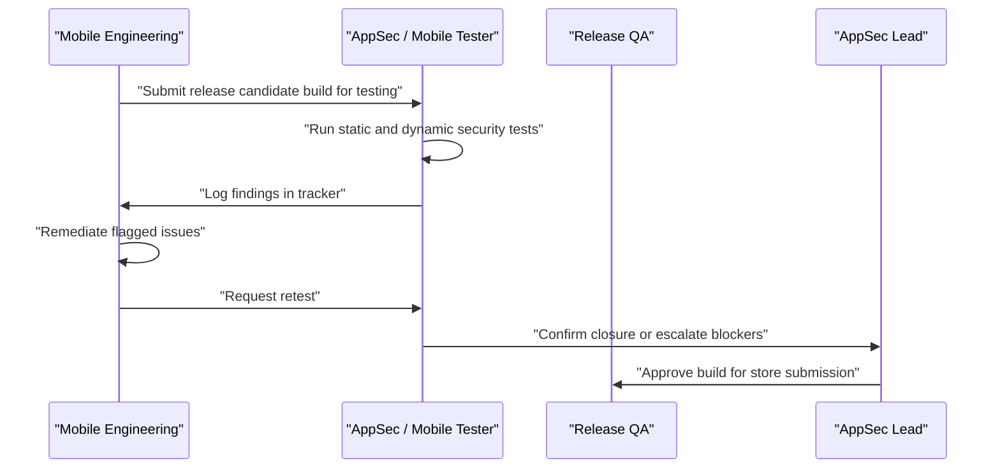

## I. Overview

**Definition**: A Secure Mobile App Testing Tracker records which security tests have been run against a mobile application build — insecure storage checks, transport security validation, reverse-engineering resistance, and platform-specific permission review — and the status of any findings.

**Features**:  
( **Ownership** ) Maintained jointly by the AppSec team and the mobile engineering team.  
( **Mobile-Specific Risk** ) Exists because mobile apps carry risks web apps do not — client-side binaries can be decompiled, and local storage and keychains can be inspected on a jailbroken or rooted device.  
( **Beyond Store Review** ) App-store review does not substitute for a security assessment.  
( **Prevents False Confidence** ) Without a tracker, mobile releases ship on the assumption that "it works" is the same as "it is safe."

## II. Structure & Process

| Field | Description |
|---|---|
| App Version / Build | Identifier of the build under test |
| Platform | **iOS** or **Android**, with minimum OS version tested |
| Test Category | e.g. **Insecure Data Storage**, **Transport Layer Security**, **Reverse Engineering / Tampering**, **Authentication**, **Permission Scope** |
| Test Method | Static binary analysis, dynamic instrumentation (e.g. on a rooted/jailbroken device), or manual review |
| Finding | Description of the weakness identified, if any |
| Severity | Risk rating of the finding |
| Status | **Open**, **In Remediation**, **Retested**, or **Closed** |
| Tester | Individual or vendor who performed the assessment |

Testing runs on every major release and on any build introducing new storage, networking, or authentication logic; the tracker is reviewed by the AppSec lead before store submission.

## III. Comparison & Application

| Test Method | Best Fit | Weakness |
|---|---|---|
| Static binary analysis | Decompiled-code review, hardcoded secrets, insecure API usage | Cannot observe actual runtime behavior |
| Dynamic instrumentation (rooted/jailbroken device) | Local storage, keychain, and certificate-pinning bypass testing | Requires a prepared test device and more tester time |
| Manual review | Business logic and permission-scope misuse | Slowest, least repeatable method |

Testing only on a clean, unmodified device is the most common shortcut mobile teams take, and it is the one that produces false confidence — controls like certificate pinning and local storage encryption often hold on a stock device and fail the moment a tester roots or jailbreaks it, which is exactly the environment a motivated attacker actually uses. Dynamic instrumentation on a rooted device is not optional hardening of the test plan; it is the test that matters most.

Related: [Web Application Vulnerability Tracker](../web-application-vulnerability-tracker/), [Static Code Analysis Log](../static-code-analysis-log/)
