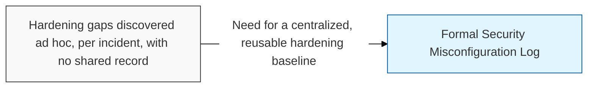
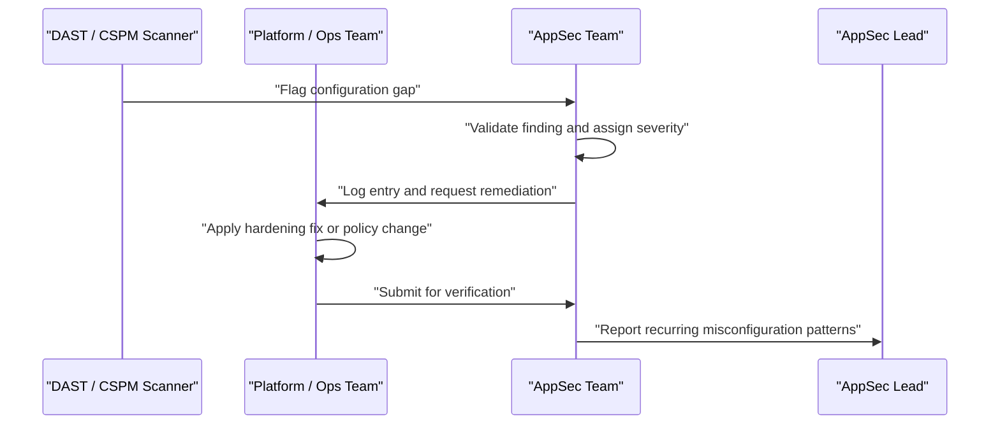

## I. Overview

A Security Misconfiguration Log tracks hardening gaps in how an application, its framework, and its supporting infrastructure are configured — default credentials left in place, verbose error messages exposing stack traces, unnecessary services or ports left open, and permissive **CORS** (Cross-Origin Resource Sharing) or cloud storage policies. It is maintained jointly by the AppSec team and platform/operations engineers, and it exists because misconfiguration is not a code defect a scanner necessarily catches at the source level — it is an operational gap that only shows up when a running system is inspected. Left untracked, the same misconfiguration tends to reappear across every new environment stood up.

## II. Structure & Process

| Field | Description |
|---|---|
| Environment | Where the misconfiguration was found, e.g. **Production**, **Staging**, specific cluster or service |
| Component | Application, framework, web server, or cloud service affected |
| Misconfiguration | Description of the gap, e.g. default admin credentials, debug mode enabled, open S3 bucket |
| Discovery Method | Manual audit, DAST scan, cloud posture tool (**CSPM**), or incident finding |
| Severity | Risk rating based on exposure and exploitability |
| Remediation | Corrective action taken or planned |
| Status | **Open**, **In Progress**, **Fixed**, or **Accepted Risk** |
| Owner | Team responsible for the affected environment or component |

Findings are logged continuously from scans, audits, and incidents; the log is reviewed monthly to identify recurring patterns worth fixing at the baseline-template level rather than per instance.

## III. Best Practices & Comparison

| Document | Primary Purpose | Update Cadence | Owner |
|---|---|---|---|
| Security Misconfiguration Log | Track operational hardening gaps in running environments | Continuous, monthly review | AppSec + Platform/Ops |
| [Patch & Update Tracker](../patch-update-tracker/) | Track known-vulnerability and version remediation, not configuration | Continuous, weekly review | AppSec Team |
| [Web Application Vulnerability Tracker](../web-application-vulnerability-tracker/) | Track exploitable application-layer findings from testing | Per scan / pentest cycle | AppSec |

- Codify fixes as infrastructure-as-code or hardened base images so a fix is not needed again per environment.
- Disable verbose error output and debug modes by default in every non-development environment.
- Audit cloud storage and API gateway policies for public or overly permissive access on a recurring schedule, not only after an incident.
- Remove default accounts and credentials before any environment is considered release-ready.
- Track recurrence: a misconfiguration found in three environments points to a broken template, not three isolated mistakes.

Related: [Patch & Update Tracker](../patch-update-tracker/), [Web Application Vulnerability Tracker](../web-application-vulnerability-tracker/)
