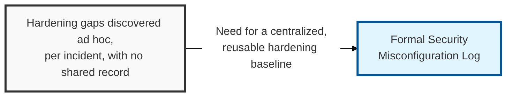
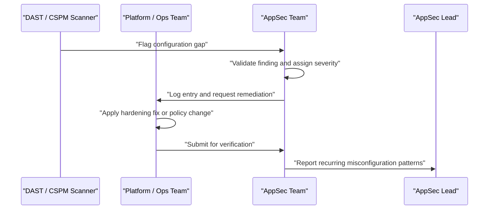

## I. Overview

**Definition**: A Security Misconfiguration Log tracks hardening gaps in how an application, its framework, and its supporting infrastructure are configured — default credentials left in place, verbose error messages exposing stack traces, unnecessary services or ports left open, and permissive **CORS** (Cross-Origin Resource Sharing) or cloud storage policies.

**Features**:  
( **Ownership** ) Maintained jointly by the AppSec team and platform/operations engineers.  
( **Distinct From Code Defects** ) Exists because misconfiguration is not a code defect a scanner necessarily catches at the source level — it is an operational gap that only shows up when a running system is inspected.  
( **Recurrence Risk** ) Left untracked, the same misconfiguration tends to reappear across every new environment stood up.

## II. Structure & Process

| Field | Description |
|---|---|
| Environment | Where the misconfiguration was found, e.g. **Production**, **Staging**, specific cluster or service |
| Component | Application, framework, web server, or cloud service affected |
| Misconfiguration | Description of the gap, e.g. default admin credentials, debug mode enabled, open S3 bucket |
| Discovery Method | Manual audit, DAST scan, cloud posture tool (**CSPM**), or incident finding |
| Severity | Risk rating based on exposure and exploitability |
| Remediation | Corrective action taken or planned |
| Status | **Open**, **In Progress**, **Fixed**, or **Accepted Risk** |
| Owner | Team responsible for the affected environment or component |

Findings are logged continuously from scans, audits, and incidents; the log is reviewed monthly to identify recurring patterns worth fixing at the baseline-template level rather than per instance.

## III. Vulnerabilities & Security Measures

| Misconfiguration Class | Primary Control |
|---|---|
| Default credentials left in place | Remove or rotate before an environment is release-ready |
| Verbose errors / debug mode enabled | Disable by default outside development, enforce via config template |
| Open storage or overly permissive CORS | Recurring automated posture audit (CSPM), not manual spot-checks |
| Unnecessary open ports or services | Hardened base image with a minimal default surface |

The real fix for a misconfiguration log entry is almost never the individual ticket — it is the base image or IaC template that produced the gap in the first place. Closing the same finding three times across three environments means the template is broken, and the log's most useful output is flagging that pattern before a fourth environment repeats it.

Related: [Patch & Update Tracker](../patch-update-tracker/), [Web Application Vulnerability Tracker](../web-application-vulnerability-tracker/)
