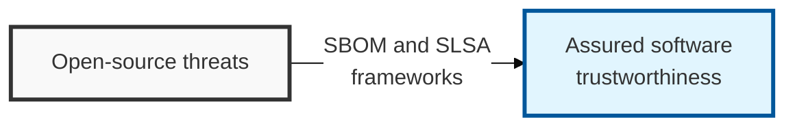

## I. Overview

**Definition**: Software supply chain security refers to the activities that manage security threats and ensure trustworthiness across the entire process — design, development, build, and deployment — by which software is produced and delivered to users.

**Features**:  
( **Responding to Surging Threats** ) The need for a proactive defense system against supply chain attacks such as the Log4j and SolarWinds incidents.  
( **Ensuring Transparency** ) Securing visibility into software components (SBOM) to enable rapid response when a vulnerability arises.  
( **Ensuring Trustworthiness** ) Verifying integrity across the entire process, from development to deployment, to prevent the distribution of tampered software.

## II. Mechanism & Components

### A. Comparison of Major SBOM Standards

The SBOM (Software Bill of Materials) — a specification of a software's component parts — is primarily represented using the industry standard SPDX and the security-focused CycloneDX.

| Category | SPDX (ISO/IEC 5962) | CycloneDX |
|------|---------------------|-----------|
| Governing Body | Linux Foundation | OWASP Foundation |
| Primary Purpose | Centered on license compliance and distribution management | Optimized for security analysis and vulnerability management |
| Data Model | Capable of complex, detailed documentation | Lightweight, easy to integrate with automation tools |
| Representation Formats | Tag/Value, JSON, YAML, RDF | JSON, XML, Protobuf |

### B. SLSA (Salsa): A Software Supply Chain Security Guideline

**Definition**: A supply chain security framework proposed by Google that defines four levels to ensure the integrity of the build process.

**Key Requirements**:
- **Source**: Managing code change history and requiring two-person review.
- **Build**: Building in an isolated environment and generating build provenance.
- **Common**: Continuous security audits and vulnerability scanning.

## III. Outlook & Future Direction

| Practice | Maturity | Direction |
|---|---|---|
| SBOM generation (SPDX / CycloneDX) | Emerging mandate | Moving from optional artifact to procurement and regulatory requirement |
| SLSA build provenance | Early adoption | Following the same trajectory container-image signing already took |
| VEX-based exploitability triage | Nascent | Becoming the standard way to suppress non-exploitable SBOM noise |

Expect SBOM generation to follow the exact arc container-image signing already went through: optional best practice, then a customer RFP checkbox, then a contractual requirement within a couple of release cycles. The teams that will be caught flat-footed are not the ones without an SBOM today — they are the ones generating one only as a one-off compliance exercise rather than wiring it into the build pipeline as a standard artifact, which means it will be stale the moment a customer's security questionnaire actually asks for one.
