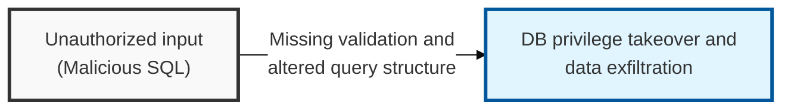
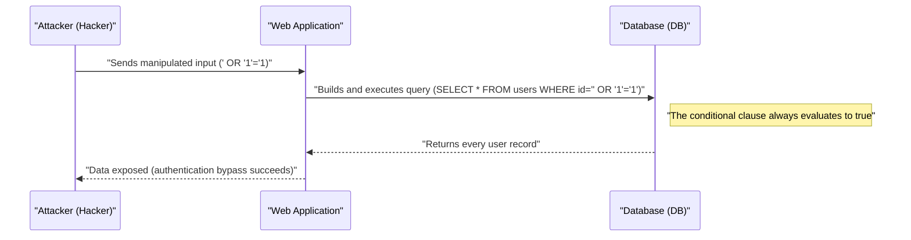

## I. Overview

**Definition**: SQL Injection is an attack technique in which user input, treated as a parameter that determines the structure of a database query, is manipulated to make the application execute unintended **SQL** statements.

**Features**:  
( **Data Exfiltration** ) An unauthorized user can query or steal sensitive information stored in the database.  
( **Authentication Bypass** ) Neutralizes login queries to attempt access to the system with administrator privileges.  
( **Integrity Destruction** ) Arbitrarily modifies or deletes data in the database, or executes system commands (e.g. via **xp_cmdshell**).

## II. Mechanism & Components

### A. Attack Process and Principle

### B. Major Classification by Data Retrieval Method

| Category | Technique | Description |
|:---:|----------|----------|
| **In-band** | Error-based | Infers query structure and data through DB error messages |
| **In-band** | Union-based | Uses the `UNION` operator to merge attacker-controlled data into the legitimate query result |
| **Inferential** | Blind (Boolean) | Extracts data one character at a time based on differences in true/false responses |
| **Inferential** | Blind (Time) | Uses time-delay functions such as `SLEEP` to confirm the existence of data |
| **Out-of-band** | OOB SQLi | Receives results via a separate channel such as **HTTP** or **DNS** |

## III. Vulnerabilities & Security Measures

| Control Area | Detailed Measure | Security Effect |
|----------|----------|----------|
| **Parameterized Query** | Treat input as a constant, never as part of query structure | Fundamentally blocks the injection, independent of filtering rules |
| **Least Privilege** | Restrict the DB connection account to only the operations it needs | Limits blast radius even if a query is compromised |
| **Error Handling** | Generic error pages, no DB error detail returned to the client | Removes the feedback channel blind and error-based SQLi depend on |
| **WAF** | Signature-based blocking of known SQLi patterns | Catches known payloads, not a substitute for the code-level fix |

Parameterized queries are the only control on this list that closes the vulnerability itself rather than reducing its blast radius or catching it after the fact — everything else here is a compensating control, useful in depth but not a substitute. A WAF rule update after a new bypass technique is discovered is reactive by definition; a parameterized query written correctly the first time never needed the update at all.
