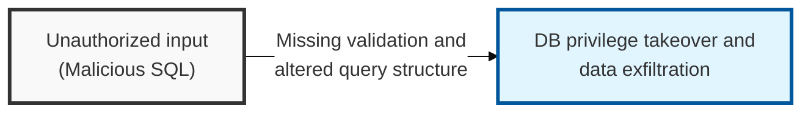
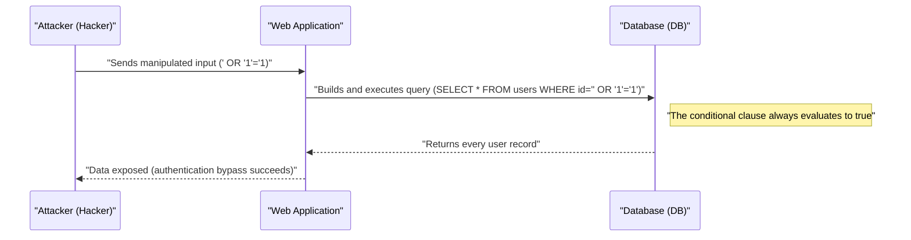

## I. Overview

**Definition**: SQL Injection is an attack technique in which user input, treated as a parameter that determines the structure of a database query, is manipulated to make the application execute unintended **SQL** statements.

**Features**:  
( **Data Exfiltration** ) An unauthorized user can query or steal sensitive information stored in the database.  
( **Authentication Bypass** ) Neutralizes login queries to attempt access to the system with administrator privileges.  
( **Integrity Destruction** ) Arbitrarily modifies or deletes data in the database, or executes system commands (e.g. via **xp_cmdshell**).

## II. Mechanism & Components

### A. Attack Process and Principle

### B. Major Classification by Data Retrieval Method

| Category | Technique | Description |
|:---:|----------|----------|
| **In-band** | Error-based | Infers query structure and data through DB error messages |
| **In-band** | Union-based | Uses the `UNION` operator to merge attacker-controlled data into the legitimate query result |
| **Inferential** | Blind (Boolean) | Extracts data one character at a time based on differences in true/false responses |
| **Inferential** | Blind (Time) | Uses time-delay functions such as `SLEEP` to confirm the existence of data |
| **Out-of-band** | OOB SQLi | Receives results via a separate channel such as **HTTP** or **DNS** |

## III. Advanced Topics & Comparison

### A. Technical Countermeasures (Secure Coding)

- **Parameterized Query**: Use `PreparedStatement` so input values are treated as plain constants rather than part of the query's structure.
- **Input Validation**: Apply whitelist-based filtering of special characters (`'`, `--`, `;`, etc.) and reserved words.
- **Stored Procedures**: The query structure is precompiled, fundamentally blocking dynamic manipulation.

### B. Administrative and Infrastructure Security Measures

| Control Area | Detailed Measure | Security Effect |
|----------|----------|----------|
| **Principle of Least Privilege** | Minimize the privileges of the DB connection account (allow only **SELECT** / **INSERT**) | Prevents system command execution and mass deletion |
| **Error Handling** | Prohibit displaying detailed DB error messages (use a **Generic Error Page**) | Blocks exposure of server structure and query information |
| **Infrastructure Security** | Deploy a Web Application Firewall (**WAF**) and keep detection rules continuously updated | Automatically blocks known **SQLi** attack patterns |

> **Key Point**: The top priority in defending against **SQL Injection** is the use of **parameterized queries**, around which a layered defense system should be built.
