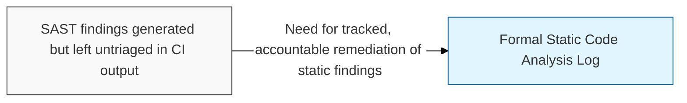
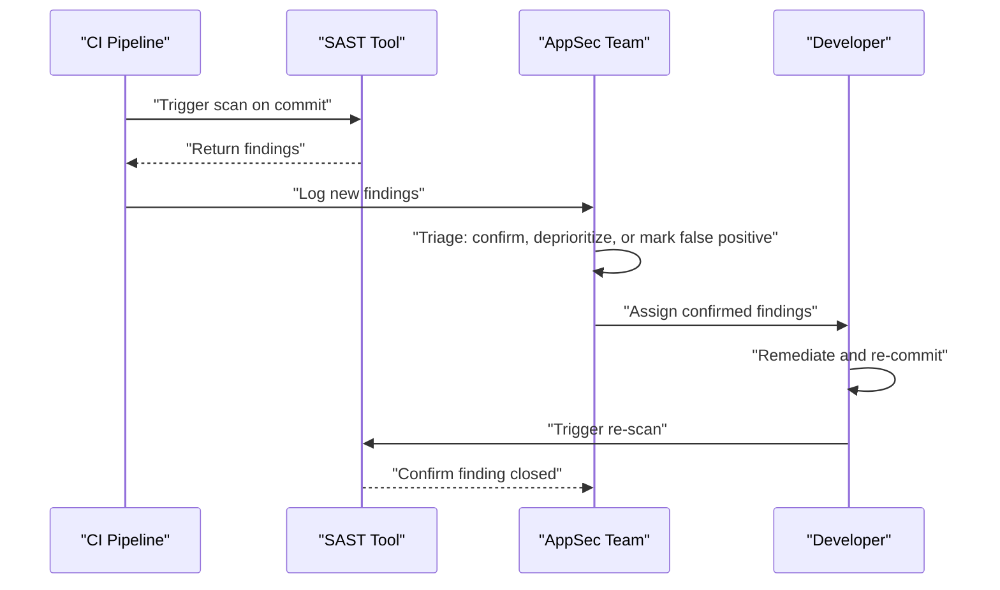

## I. Overview

A Static Code Analysis Log records the findings produced by **SAST** (Static Application Security Testing) tools scanning source code before it runs — insecure API usage, hardcoded secrets, and syntax patterns known to cause injection or memory-safety issues — along with each finding's disposition. It is maintained by the AppSec team with remediation performed by the owning engineering team, and it exists because SAST is only useful if its output is triaged and acted on; a scanner that runs but whose findings pile up unreviewed provides no more protection than not scanning at all.

## II. Structure & Process

| Field | Description |
|---|---|
| Repository / Component | Codebase or service where the finding occurred |
| Rule / Weakness Type | Class of issue, e.g. **hardcoded credential**, **SQL injection sink**, **unsafe deserialization**, mapped to a CWE ID |
| File / Location | Path and line number of the flagged code |
| Severity | Tool-assigned rating, adjusted by AppSec triage |
| Status | **New**, **Triaged**, **False Positive**, **In Remediation**, or **Fixed** |
| Build / Commit Reference | CI run or commit hash the finding was detected in |
| Assignee | Developer responsible for resolving the finding |

The scan runs automatically on every commit or pull request; AppSec triages new findings within one business day, and the full log is reviewed weekly for aging high-severity items.

## III. Best Practices & Comparison

| Document | Primary Purpose | Update Cadence | Owner |
|---|---|---|---|
| Static Code Analysis Log | Track source-level SAST findings from automated scanning | Per build / commit | AppSec + Engineering |
| [Secure Coding Checklist](../secure-coding-checklist/) | Preventive standard SAST rules are derived from and enforce | Per pull request | AppSec + Engineering |
| [Web Application Vulnerability Tracker](../web-application-vulnerability-tracker/) | Runtime (DAST) findings, complementary black-box view | Per scan / pentest cycle | AppSec |
| SCA (Software Composition Analysis) tooling | Scans dependencies rather than first-party source code | Continuous | AppSec |

- Tune the SAST ruleset for the codebase's actual languages and frameworks to keep the false-positive rate manageable.
- Triage every new finding within a fixed SLA so the backlog does not become the default state.
- Gate merges on new critical/high findings, but avoid blocking on unreviewed low-severity noise.
- Track false-positive rate over time as a signal for when to retune rules, not just as review overhead.
- Correlate recurring finding types back into the Secure Coding Checklist so the same mistake stops shipping.

Related: [Secure Coding Checklist](../secure-coding-checklist/), [Web Application Vulnerability Tracker](../web-application-vulnerability-tracker/)
