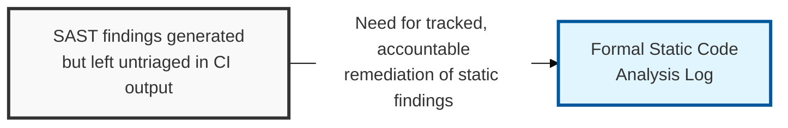
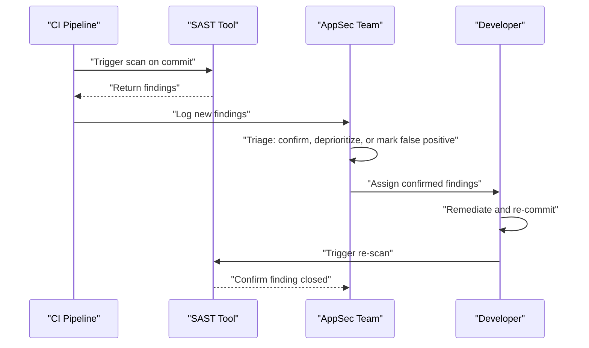

## I. Overview

**Definition**: A Static Code Analysis Log records the findings produced by **SAST** (Static Application Security Testing) tools scanning source code before it runs — insecure API usage, hardcoded secrets, and syntax patterns known to cause injection or memory-safety issues — along with each finding's disposition.

**Features**:  
( **Ownership** ) Maintained by the AppSec team, with remediation performed by the owning engineering team.  
( **Triage Requirement** ) Exists because SAST is only useful if its output is triaged and acted on.  
( **Prevents Silent Scanning** ) A scanner that runs but whose findings pile up unreviewed provides no more protection than not scanning at all.

## II. Structure & Process

| Field | Description |
|---|---|
| Repository / Component | Codebase or service where the finding occurred |
| Rule / Weakness Type | Class of issue, e.g. **hardcoded credential**, **SQL injection sink**, **unsafe deserialization**, mapped to a CWE ID |
| File / Location | Path and line number of the flagged code |
| Severity | Tool-assigned rating, adjusted by AppSec triage |
| Status | **New**, **Triaged**, **False Positive**, **In Remediation**, or **Fixed** |
| Build / Commit Reference | CI run or commit hash the finding was detected in |
| Assignee | Developer responsible for resolving the finding |

The scan runs automatically on every commit or pull request; AppSec triages new findings within one business day, and the full log is reviewed weekly for aging high-severity items.

## III. Outlook & Future Direction

| Practice | Maturity | Direction |
|---|---|---|
| Rule tuning per codebase | Standard practice | Moving toward auto-tuned baselines instead of manual rule curation |
| Manual triage of every finding | Common today | Shrinking as tools improve confidence scoring and dedup accuracy |
| IDE-integrated real-time feedback | Emerging | Becoming the default, pushing triage earlier than the CI log itself |

The direction this log is heading is toward its own obsolescence as a manual triage queue — as SAST tools get better at scoring exploitability and suppressing duplicate findings, the log's role shifts from where humans decide what is real to the audit trail for decisions the tool already made with high confidence. Teams still spending most of their AppSec triage time on findings a modern tool could auto-dismiss are tuning the wrong thing.

Related: [Secure Coding Checklist](../secure-coding-checklist/), [Web Application Vulnerability Tracker](../web-application-vulnerability-tracker/)
