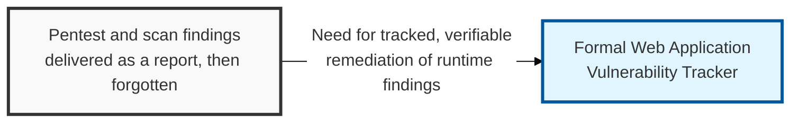
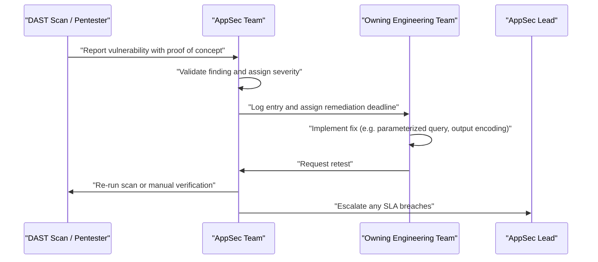

## I. Overview

**Definition**: A Web Application Vulnerability Tracker records findings from dynamic testing against a running application — **DAST** (Dynamic Application Security Testing) scans, penetration tests, and bug bounty reports — covering classes like SQL injection, XSS, CSRF, and broken access control.

**Features**:  
( **Ownership** ) Maintained by the AppSec team, who coordinate remediation with the engineering team that owns the affected service.  
( **Black-Box Coverage** ) Exists because black-box testing surfaces exploitable conditions that source-level review can miss — authentication bypasses and business-logic flaws.  
( **Runtime Focus** ) Captures issues that only manifest once the application is deployed and reachable.  
( **Prevents Forgotten Findings** ) Without a tracker, findings from a pentest engagement risk becoming a one-time PDF that no one revisits.

## II. Structure & Process

| Field | Description |
|---|---|
| Application / URL | Target application or endpoint where the finding occurred |
| Vulnerability Class | e.g. **SQL Injection**, **XSS** (Stored, Reflected, or DOM-based), **CSRF**, **Broken Access Control** |
| Discovery Source | **DAST** scan, manual penetration test, or bug bounty submission |
| Severity | CVSS score or equivalent risk rating |
| Proof of Concept | Steps or payload demonstrating the exploit, stored securely |
| Status | **Open**, **In Remediation**, **Retested**, or **Closed** |
| Remediation Deadline | SLA-driven date based on severity |
| Owner | Engineering team responsible for the affected application |

Findings are logged as scans and engagements complete; the tracker is reviewed weekly by AppSec and formally audited after each scheduled penetration test.

## III. Vulnerabilities & Security Measures

| Vulnerability Class | Primary Control |
|---|---|
| SQL Injection | Parameterized queries |
| XSS (Stored / Reflected / DOM) | Output encoding + CSP |
| CSRF | CSRF token + SameSite cookies |
| Broken Access Control | Object- and function-level authorization checks on every request |

A pentest report that only lists findings without a retest date is a snapshot of risk on one specific day, not a security posture — the tracker's actual job is turning that snapshot into a closed loop. The discipline worth enforcing is retesting against the original proof of concept, not the ticket description: a fix that satisfies the ticket but does not actually block the original payload is a false close, and it is the single most common way a finding quietly comes back in the next pentest cycle.

Related: [Static Code Analysis Log](../static-code-analysis-log/), [Secure Coding Checklist](../secure-coding-checklist/)
