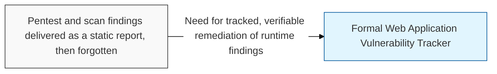
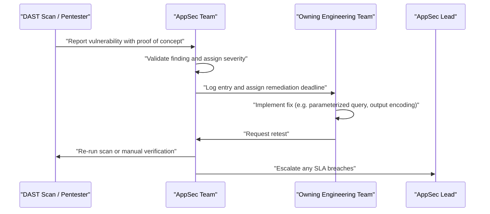

## I. Overview

A Web Application Vulnerability Tracker records findings from dynamic testing against a running application — **DAST** (Dynamic Application Security Testing) scans, penetration tests, and bug bounty reports — covering classes like SQL injection, XSS, CSRF, and broken access control. It is maintained by the AppSec team, who coordinate remediation with the engineering team that owns the affected service, and it exists because black-box testing surfaces exploitable conditions that source-level review can miss: authentication bypasses, business-logic flaws, and issues that only manifest once the application is deployed and reachable. Without a tracker, findings from a pentest engagement risk becoming a one-time PDF that no one revisits.

## II. Structure & Process

| Field | Description |
|---|---|
| Application / URL | Target application or endpoint where the finding occurred |
| Vulnerability Class | e.g. **SQL Injection**, **XSS** (Stored, Reflected, or DOM-based), **CSRF**, **Broken Access Control** |
| Discovery Source | **DAST** scan, manual penetration test, or bug bounty submission |
| Severity | CVSS score or equivalent risk rating |
| Proof of Concept | Steps or payload demonstrating the exploit, stored securely |
| Status | **Open**, **In Remediation**, **Retested**, or **Closed** |
| Remediation Deadline | SLA-driven date based on severity |
| Owner | Engineering team responsible for the affected application |

Findings are logged as scans and engagements complete; the tracker is reviewed weekly by AppSec and formally audited after each scheduled penetration test.

## III. Best Practices & Comparison

| Document | Primary Purpose | Update Cadence | Owner |
|---|---|---|---|
| Web Application Vulnerability Tracker | Track exploitable runtime findings from DAST and pentesting | Per scan / pentest cycle | AppSec |
| [Static Code Analysis Log](../static-code-analysis-log/) | Source-level findings from SAST, complementary white-box view | Per build / commit | AppSec + Engineering |
| [Secure Coding Checklist](../secure-coding-checklist/) | Preventive standard that reduces recurrence of the same finding classes | Per pull request | AppSec + Engineering |
| OWASP Top 10 | Reference taxonomy most findings are classified against | On standard revision | AppSec |

- Store every proof of concept and payload in a restricted-access location, never in a general ticket visible to all staff.
- Map each finding to its OWASP Top 10 category to spot which vulnerability classes recur most often.
- Retest every fix against the original proof of concept before marking a finding closed, not just against the ticket description.
- Run DAST scans continuously against staging, not only during scheduled pentest windows.
- Feed recurring finding classes back into the Secure Coding Checklist and SAST ruleset to prevent reintroduction.

Related: [Static Code Analysis Log](../static-code-analysis-log/), [Secure Coding Checklist](../secure-coding-checklist/)
