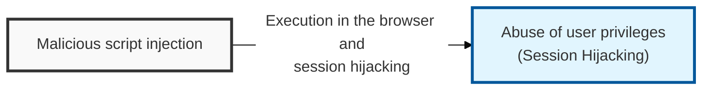
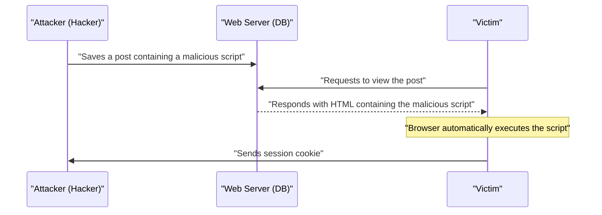

## I. Overview

**Definition**: XSS (Cross-Site Scripting) is a security vulnerability in which an attacker injects a malicious script into a web application so that the script executes in the browser of any user who views the page.

**Features**:  
( **Session Hijacking** ) Steals the session token stored in the user's cookie to take over the account and perform actions on the victim's behalf.  
( **Personal Information Leakage** ) Uses the script to send sensitive information from the page to an external server or redirect the user to a phishing site.  
( **User Deception** ) Serves as a foothold for arbitrarily modifying web page content or distributing malicious software.

## II. Mechanism & Components

### A. Stored XSS Process

### B. Detailed Comparison of Attack Types

| Type | Attack Method | Script Storage Location | Primary Attack Surface |
|:---:|----------|:---------------:|--------------|
| **Stored XSS** | Permanently stores the script in a bulletin board, profile, etc. | Server database ( **DB** ) | Bulletin boards, comments, guestbooks |
| **Reflected XSS** | Input such as a search term is immediately reflected back into the response page | Response message ( **Non-persistent** ) | Search results, error messages, **URL** parameters |
| **DOM-based XSS** | A client-side script dynamically processes **DOM** data | Client browser ( **DOM** ) | `innerHTML`, `document.write` in **JavaScript** |

## III. Advanced Topics & Comparison

### A. Technical Countermeasures (Secure Coding)

- **Output Encoding**: When rendering user input as **HTML**, convert special characters ( `<`, `>`, `&`, `"`, etc. ) into **HTML Entities** to prevent execution.
- **Input Filtering**: Apply whitelist-based validation against dangerous tags and event handlers such as `<script>`, `onerror`, and `onload`.
- **Security Headers**:  
  - **Content Security Policy** ( **CSP** ): Enforces a browser policy that only allows scripts from approved domains to execute.  
  - **X-XSS-Protection**: Enables the browser's built-in **XSS** filter to help block attacks.

### B. Browser-Side Security Measures

| Measure | Details | Security Effect |
|----------|----------|----------|
| **HttpOnly Cookie** | Blocks **JavaScript** access via `document.cookie` | Fundamentally prevents session cookie theft ( **Session Hijacking** ) through **XSS** |
| **Secure Cookie** | Transmits cookies only over the **HTTPS** protocol | Defends against cookie sniffing on the network segment |
| **SameSite Cookie** | Controls how cookies are sent to third-party sites ( **Lax** / **Strict** ) | Defends against **CSRF** attacks and mitigates some **XSS** damage |

> **Key Point**: The foundation of **XSS** defense is assuming that "all user input is untrusted," and applying thorough **entity encoding** at the output stage together with a **CSP**.
