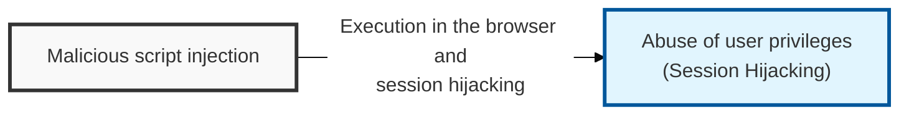
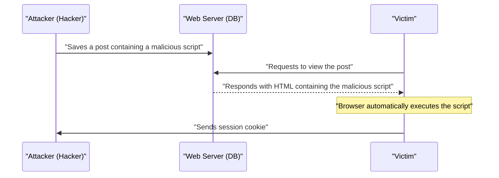

## I. Overview

**Definition**: XSS (Cross-Site Scripting) is a security vulnerability in which an attacker injects a malicious script into a web application so that the script executes in the browser of any user who views the page.

**Features**:  
( **Session Hijacking** ) Steals the session token stored in the user's cookie to take over the account and perform actions on the victim's behalf.  
( **Personal Information Leakage** ) Uses the script to send sensitive information from the page to an external server or redirect the user to a phishing site.  
( **User Deception** ) Serves as a foothold for arbitrarily modifying web page content or distributing malicious software.

## II. Mechanism & Components

### A. Stored XSS Process

### B. Detailed Comparison of Attack Types

| Type | Attack Method | Script Storage Location | Primary Attack Surface |
|:---:|----------|:---------------:|--------------|
| **Stored XSS** | Permanently stores the script in a bulletin board, profile, etc. | Server database ( **DB** ) | Bulletin boards, comments, guestbooks |
| **Reflected XSS** | Input such as a search term is immediately reflected back into the response page | Response message ( **Non-persistent** ) | Search results, error messages, **URL** parameters |
| **DOM-based XSS** | A client-side script dynamically processes **DOM** data | Client browser ( **DOM** ) | `innerHTML`, `document.write` in **JavaScript** |

## III. Vulnerabilities & Security Measures

| Attack Vector | Primary Control |
|---|---|
| Stored XSS | Output encoding + CSP |
| Reflected XSS | Input validation + output encoding |
| DOM-based XSS | Safe DOM APIs (`textContent`) instead of `innerHTML` |

Content Security Policy is the control most teams under-invest in relative to its impact — output encoding stops the majority of injection attempts, but a strict CSP is the one control that still helps the day a new encoding bypass is discovered. HttpOnly cookies matter for a related but distinct reason: they don't prevent the script from running, but they contain the blast radius so a successful injection doesn't automatically become session hijacking. Treat CSP rollout as its own security-debt-reduction project, not an afterthought bolted onto the XSS ticket.
