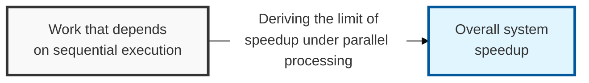
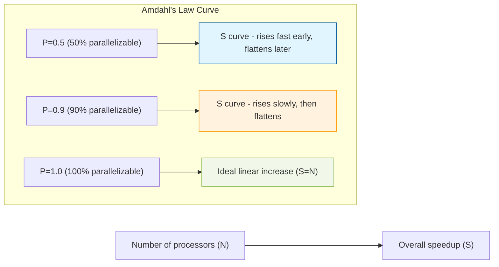

## I. Overview

**Definition**: A principle stating that the maximum speedup achievable by parallelizing a given task is limited by the proportion of that task which must inevitably run sequentially.

**Features**:  
( **Bottleneck of Sequential Processing** ) No matter how many processors are added, the portion of a system that must run sequentially (serial) gains no benefit from parallel processing.  
( **Upper Bound on Speedup** ) The higher the proportion of work that cannot participate in parallel processing, the more the overall system speedup diminishes.  
( **Importance of Architectural Design** ) Implies that designing an architecture favorable to parallel processing (MSA, distributed systems) is the key to scaling performance.  
( **Proposed by Gene Amdahl** ) Proposed in 1967 by Gene Amdahl, this theory remains the foundation for predicting parallel computing performance.

## II. Mechanism & Components

### A. Amdahl's Law Formula

`Speedup(S) = 1 / ((1 - P) + P/N)`

- `S`: The maximum overall system speedup
- `P`: The proportion of the total task that can be parallelized (proportion of parallelizable work)
- `N`: The number of available processors
- `(1-P)`: The proportion of the total task that must run sequentially (proportion of serial work)

### B. Speedup Curve as the Number of Processors Increases

## III. Advanced Topics & Comparison

### Applications of Amdahl's Law in Parallel Computing Environments

| Application Area | Details | Security and Performance Implications |
|:---:|----------|------------------|
| **Large-Scale Data Processing** | Big data analytics, machine learning model training, etc. | Optimizing sequential logic (preprocessing, result aggregation) is critical |
| **Distributed Systems** | Inter-service communication within an MSA environment | Network latency acts as sequential processing time |
| **Parallel Attack/Defense** | Distributed DDoS attacks, multi-threaded vulnerability scanning | Attack/defense efficiency does not scale proportionally with parallel resources |

### Strategies for Overcoming the Limits of Amdahl's Law

- **Maximizing the Parallelizable Portion**: Design the architecture to minimize the proportion of sequential work (1-P) in the overall system
- **Efficient Communication Channels**: Maximize the value of P (proportion parallelizable) by reducing inter-node communication overhead (e.g. gRPC, RDMA)
- **Finer-Grained Parallel Units**: Increase parallel processing efficiency by dividing the overall task into small, independent units rather than large ones

> **Key point**: Amdahl's Law dispels the illusion that parallel computing is a cure-all, underscores the importance of **architectural design**, and shows that continually managing a system's **sequential bottlenecks** is the key to performance optimization.
