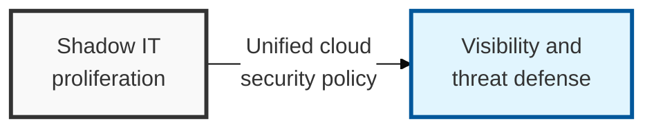

## I. Overview

**Definition**: A CASB is a security solution or service placed between an organization's on-premises infrastructure and its cloud services that applies security policy consistently and provides visibility across that boundary.

**Features**:  
( **Shadow IT Control** ) Identifies and manages the risk of unauthorized cloud services used outside organizational control.  
( **Data Leakage Prevention** ) Blocks the exfiltration of sensitive information through DLP capabilities optimized for cloud environments.  
( **Account Protection** ) Detects abnormal logins and applies access control to counter cloud account takeover attacks.

## II. Mechanism & Components

### A. The Four Core Security Pillars of CASB

- **Visibility**: Identifies every cloud service in use across the organization and assesses its risk (Shadow IT detection)
- **Data Security**: Applies DLP (data loss prevention), encryption, and access control to data stored in the cloud
- **Compliance**: Continuously checks compliance with regulations such as data protection laws and PCI-DSS
- **Threat Protection**: Detects abnormal logins (anomaly detection), blocks malware propagation, and performs user and entity behavior analytics (UEBA)

### B. Comparison of CASB Deployment Methods

| Category | **API Mode** (Out-of-Band) | **Proxy Mode** (In-Line) |
|------|---------------------------|--------------------------|
| **Operating Principle** | Calls the cloud service's API directly | Sits in the traffic path for real-time monitoring |
| **Performance Impact** | No added network latency | Traffic passes through the broker, which can affect performance |
| **Coverage** | Focused on managed cloud services | Can also control Shadow IT and unmanaged apps |
| **Timing** | Analysis occurs after data has already been stored | Enables real-time blocking at the point of data transfer |
| **Characteristics** | Easy to install but can be bypassed | Configured as a forward or reverse proxy |

## III. Comparison & Application

| Comparison Item | Traditional DLP / Proxy Solutions | CASB (Cloud-Native) |
|----------|-----------------------|---------------------|
| **Security Scope** | Internal network and endpoints | External cloud services such as SaaS and PaaS |
| **Identification Unit** | Centered on IP addresses and URLs | User accounts and app-level actions (e.g. share, delete) |
| **Access Control** | Simple allow / deny | Fine-grained, behavior-based control (context-aware) |
| **Visibility Scope** | Limited to internal network traffic | Includes external traffic from mobile and remote work |

Don't retire the legacy DLP/proxy stack the day CASB goes live — they solve different problems, not the same problem better. CASB's context-aware controls have nothing to say about a file copied to a USB drive, and a network proxy has no visibility into an S3 bucket made public through an API call. Default to API-mode CASB for visibility into already-sanctioned SaaS, and reserve proxy-mode in-line inspection for where real-time blocking of unsanctioned Shadow IT use is a hard requirement — that real-time control comes at the cost of a traffic-path dependency most teams end up regretting.
