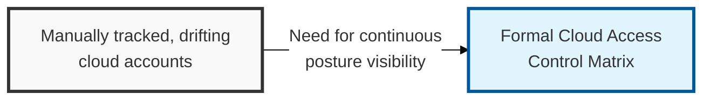
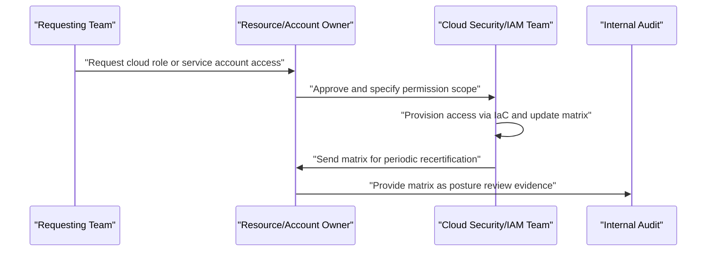

## I. Overview

**Definition**: A Cloud Access Control Matrix is a structured inventory of every identity — human user, group, or service account — with access to a cloud account, subscription, or project, together with the role, permission scope, and resource boundary each identity holds.

**Features**:  
( **Ownership** ) Maintained by the cloud security or platform engineering team in coordination with resource owners.  
( **Multi-Cloud Scope** ) Extends the traditional access matrix concept into environments where identities span multiple providers, cross-account roles, and machine-to-machine service accounts.  
( **Least Privilege Verification** ) Confirms whether privileged cloud access matches job function.  
( **Stale Grant Detection** ) Surfaces stale grants and orphaned service accounts that would otherwise remain active.

## II. Structure & Process

| Field | Description |
|---|---|
| Cloud Account/Subscription | The specific account, project, or subscription the entry applies to. |
| Identity Type | Human user, group, federated identity, or service/machine account. |
| Role/Policy Name | The IAM role or managed policy assigned. |
| Permission Scope | Actions permitted, e.g. read-only, contributor, administrator. |
| Resource Scope | Boundary of the grant, e.g. specific resource group, tag, or account-wide. |
| MFA Enforced | Whether multi-factor authentication is required for this identity. |
| Business Justification | Why this identity requires this level of cloud access. |
| Approver | Resource owner or cloud security lead who authorized the grant. |
| Last Review Date | Date of the most recent access recertification. |

The matrix is updated whenever a role, policy, or service account is provisioned or changed, and undergoes full recertification on a fixed cadence — typically monthly for administrative and cross-account roles, and quarterly for standard access — with resource owners attesting each entry is still required.

## III. Expected Benefits & Implications

The matrix's value isn't the spreadsheet of who-has-what — most teams could reconstruct that from IAM APIs in an afternoon — it's the recurring recertification trail proving privileged and cross-account access was actually reviewed, not just granted once and forgotten. That trail is what turns a least-privilege claim into evidence an ISMS-P or SOC 2 assessor will actually accept.

| Benefit | Where It Shows Up |
|---|---|
| Faster access-review audits | Recertification records instead of ad hoc IAM exports |
| Fewer orphaned service accounts | Scheduled attestation catches grants nobody remembers making |
| Reduced blast radius on compromise | Least-privilege scoping limits what a stolen credential can reach |

Machine identities are where this discipline usually collapses in practice: a service account never complains that its access is too broad, so privilege accumulates silently unless recertification is applied to it with the same rigor as a human account — arguably more, since nobody's badge access expiring will ever flag it.

Related: [Cloud Asset Inventory Tracker](../cloud-asset-inventory-tracker/), [Cloud Security Configuration Baseline](../cloud-security-configuration-baseline/).
