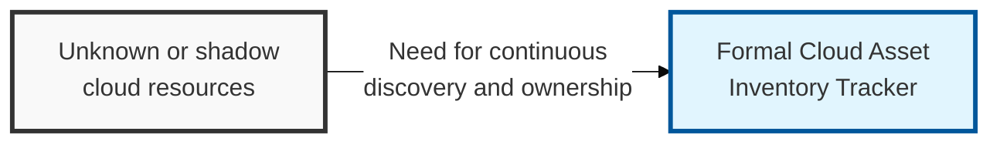

## I. Overview

**Definition**: A Cloud Asset Inventory Tracker is a continuously updated register of every resource running across an organization's cloud accounts — virtual machines, containers, storage buckets, managed databases, serverless functions, and PaaS/SaaS subscriptions — along with its owner, environment, and data sensitivity.

**Features**:  
( **Ownership** ) Maintained by the cloud platform team, populated primarily through automated discovery rather than manual entry.  
( **Reconciliation** ) Cross-checked against billing records and API scans to surface resources never registered through a formal process.  
( **Shadow Resource Control** ) Addresses how cloud elasticity makes unmanaged, forgotten, or shadow resources easy to create and easy to miss.  
( **Foundational Scope** ) Serves as the foundation every other cloud security control — access review, patching, backup — depends on for accurate scope.

## II. Structure & Process

```mermaid
flowchart LR
    Scan["Automated Discovery Scan\n(CSPM / API / Billing)"] -- "Surfaces new or changed assets" --> Reconcile["Platform Team Reconciles Inventory"]
    Reconcile -- "Unowned or unexpected asset found" --> Flag["Flag for Owner Assignment"]
    Flag -- "Owner confirms or asset is decommissioned" --> Update["Inventory Updated"]
    Update -- "Feeds scoped review" --> Review["Security Review of Shadow/Orphaned Assets"]
```

| Field | Description |
|---|---|
| Asset ID | Unique identifier or ARN/resource ID assigned by the provider. |
| Asset Type | Compute, storage, network, managed database, container, or serverless function. |
| Cloud Provider & Account | The provider and specific account, subscription, or project hosting the asset. |
| Region | Geographic region the resource is deployed in. |
| Owner/Team | The team or individual accountable for the resource. |
| Environment | Production, staging, development, or sandbox. |
| Data Classification | Sensitivity of data the asset stores or processes, if any. |
| Discovery Method | Agentless API scan, CSPM tool, billing reconciliation, or manual registration. |
| Last Verified Date | When the asset's existence and ownership were last confirmed. |

Discovery scans run continuously or on a fixed schedule (typically daily), with the platform team reconciling results into the inventory and routing any unowned or unexpected asset to security for a shadow-resource review before it is either assigned an owner or decommissioned.

## III. Vulnerabilities & Security Measures

| Risk | Primary Control |
|---|---|
| Shadow or forgotten resources | Continuous agentless discovery (API scan, CSPM) |
| Orphaned assets with no accountable owner | Scheduled reconciliation against cloud billing records |
| Stale inventory feeding wrongly scoped reviews | Mandatory owner/environment tagging enforced at creation via policy-as-code |

Billing reconciliation is what actually catches what discovery scans consistently miss — a "decommissioned" VM that's still running, or a bucket spun up for a two-day proof of concept eighteen months ago, keeps generating a charge line long after it drops off every dashboard and tagging policy. Route anything unexplained on the monthly invoice straight into the shadow-resource review queue instead of a cost-optimization backlog; by the time finance flags it as a spend anomaly, it has typically already been an unmonitored attack surface for months.

Related: [Cloud Access Control Matrix](../cloud-access-control-matrix/), [Cloud Security Configuration Baseline](../cloud-security-configuration-baseline/).
