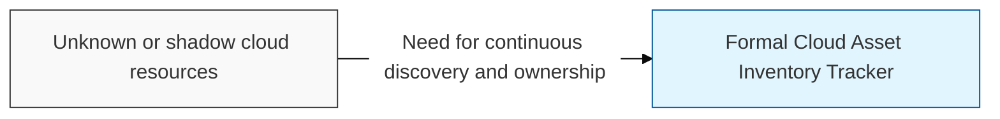

## I. Overview

A Cloud Asset Inventory Tracker is a continuously updated register of every resource running across an organization's cloud accounts — virtual machines, containers, storage buckets, managed databases, serverless functions, and PaaS/SaaS subscriptions — along with its owner, environment, and data sensitivity. It is maintained by the cloud platform team, populated primarily through automated discovery rather than manual entry, and reconciled against billing and API scans to surface resources that were never registered through a formal process. Cloud elasticity makes unmanaged, forgotten, or shadow resources easy to create and easy to miss, so this tracker is the foundation every other cloud security control — access review, patching, backup — depends on for accurate scope.

## II. Structure & Process

```mermaid
flowchart LR
    Scan["Automated Discovery Scan\n(CSPM / API / Billing)"] -- "Surfaces new or changed assets" --> Reconcile["Platform Team Reconciles Inventory"]
    Reconcile -- "Unowned or unexpected asset found" --> Flag["Flag for Owner Assignment"]
    Flag -- "Owner confirms or asset is decommissioned" --> Update["Inventory Updated"]
    Update -- "Feeds scoped review" --> Review["Security Review of Shadow/Orphaned Assets"]
```

| Field | Description |
|---|---|
| Asset ID | Unique identifier or ARN/resource ID assigned by the provider. |
| Asset Type | Compute, storage, network, managed database, container, or serverless function. |
| Cloud Provider & Account | The provider and specific account, subscription, or project hosting the asset. |
| Region | Geographic region the resource is deployed in. |
| Owner/Team | The team or individual accountable for the resource. |
| Environment | Production, staging, development, or sandbox. |
| Data Classification | Sensitivity of data the asset stores or processes, if any. |
| Discovery Method | Agentless API scan, CSPM tool, billing reconciliation, or manual registration. |
| Last Verified Date | When the asset's existence and ownership were last confirmed. |

Discovery scans run continuously or on a fixed schedule (typically daily), with the platform team reconciling results into the inventory and routing any unowned or unexpected asset to security for a shadow-resource review before it is either assigned an owner or decommissioned.

## III. Best Practices & Comparison

| Document | Primary Purpose | Update Cadence | Owner |
|---|---|---|---|
| Cloud Asset Inventory Tracker | Track which resources exist and who owns them | Continuous, discovery-driven | Cloud platform team |
| Cloud Access Control Matrix | Track which identities can act on which resources | Continuous, with periodic recertification | Cloud security/IAM team |
| CSPM tooling (Cloud Security Posture Management) | Automate configuration and compliance scanning across discovered assets | Continuous, real-time | Cloud security team |

- Prefer agentless, API-based discovery over relying on teams to self-register resources.
- Reconcile discovery results against cloud billing records to catch resources CSPM scans miss.
- Enforce mandatory owner and environment tagging at resource creation through policy-as-code.
- Treat any asset without a confirmed owner as a security finding, not a data-quality nuisance.
- Review orphaned or long-idle resources on a fixed cadence and route them to decommissioning.

Related: [Cloud Access Control Matrix](../cloud-access-control-matrix/), [Cloud Security Configuration Baseline](../cloud-security-configuration-baseline/).
