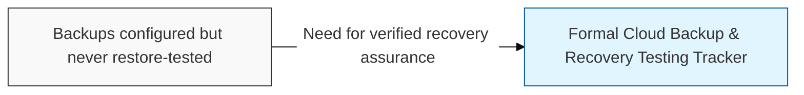
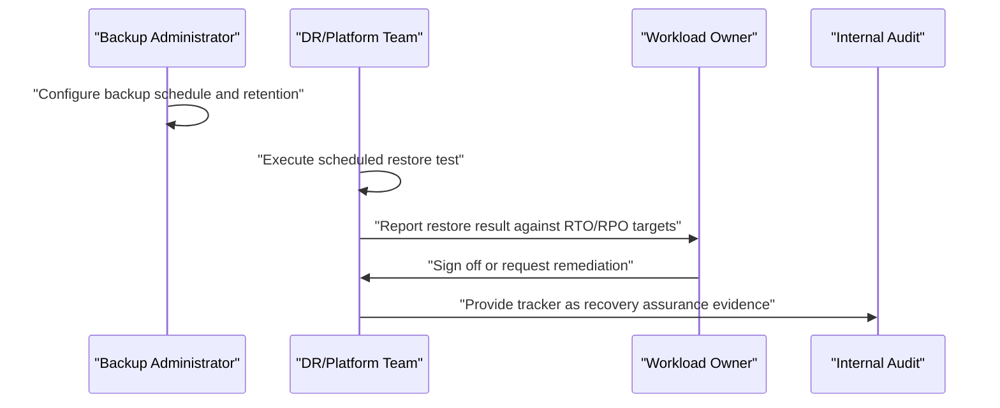

## I. Overview

A Cloud Backup & Recovery Testing Tracker records what is backed up in cloud environments, how, and — critically — when the restore was last tested and whether it succeeded. It is maintained by the cloud platform or disaster recovery team, with sign-off from workload owners on recovery results. A configured backup that has never been restored is an unverified assumption, not a control; this tracker exists so recovery point and recovery time objectives are demonstrated against real restore attempts rather than inferred from a backup job's success status.

## II. Structure & Process

| Field | Description |
|---|---|
| System/Workload | The application, database, or resource the backup protects. |
| Backup Method | Snapshot, managed backup service, or cross-region/cross-account replication. |
| Backup Frequency | How often backups are taken. |
| Retention Period | How long backups are kept before expiry. |
| RPO Target | Recovery point objective — maximum tolerable data loss. |
| RTO Target | Recovery time objective — maximum tolerable downtime. |
| Last Restore Test Date | When the restore was most recently exercised. |
| Restore Test Result | Pass, fail, or pass with noted gaps. |
| Next Scheduled Test | Date of the next planned restore exercise. |

Backup jobs run on their configured schedule, but restore tests are executed on a separate, explicit cadence — typically quarterly for critical workloads — with the workload owner signing off on whether the result met agreed RTO/RPO targets before the tracker entry is closed.

## III. Best Practices & Comparison

| Document | Primary Purpose | Update Cadence | Owner |
|---|---|---|---|
| Cloud Backup & Recovery Testing Tracker | Verify backups can actually be restored within target objectives | Quarterly restore tests, continuous backup logging | Cloud platform/DR team |
| Cloud Incident Response Log | Record and track security incidents through resolution | Per incident | Cloud security operations |
| Cloud Security Configuration Baseline | Define hardened settings, including backup and replication requirements | Version-controlled, updated per provider changes | Cloud security architecture team |

- Schedule restore tests as a standing calendar commitment, not an ad hoc task triggered by concern.
- Validate RTO/RPO against actual business requirements, not the provider's default backup settings.
- Include cross-region and cross-account failure scenarios for workloads with high availability requirements.
- Store restore test evidence (logs, timestamps, sign-off) for audit and compliance review.
- Define backup and retention configuration as code to prevent silent drift from the approved baseline.

Related: [Cloud Incident Response Log](../cloud-incident-response-log/), [Cloud Security Configuration Baseline](../cloud-security-configuration-baseline/).
