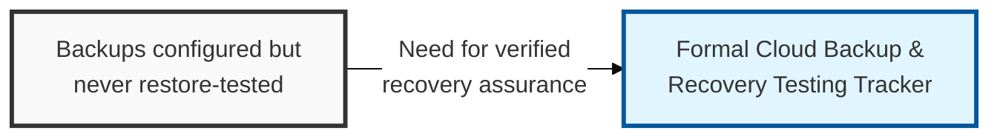
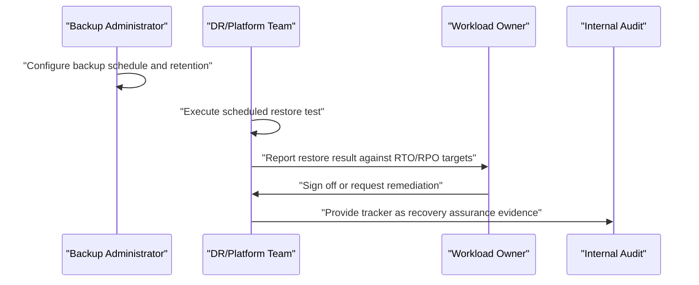

## I. Overview

**Definition**: A Cloud Backup & Recovery Testing Tracker records what is backed up in cloud environments, how, and — critically — when the restore was last tested and whether it succeeded.

**Features**:  
( **Ownership** ) Maintained by the cloud platform or disaster recovery team, with sign-off from workload owners on recovery results.  
( **Verified Assurance** ) Treats a backup that has never been restored as an unverified assumption, not a control.  
( **Objective Validation** ) Demonstrates recovery point and recovery time objectives against real restore attempts rather than a backup job's success status.

## II. Structure & Process

| Field | Description |
|---|---|
| System/Workload | The application, database, or resource the backup protects. |
| Backup Method | Snapshot, managed backup service, or cross-region/cross-account replication. |
| Backup Frequency | How often backups are taken. |
| Retention Period | How long backups are kept before expiry. |
| RPO Target | Recovery point objective — maximum tolerable data loss. |
| RTO Target | Recovery time objective — maximum tolerable downtime. |
| Last Restore Test Date | When the restore was most recently exercised. |
| Restore Test Result | Pass, fail, or pass with noted gaps. |
| Next Scheduled Test | Date of the next planned restore exercise. |

Backup jobs run on their configured schedule, but restore tests are executed on a separate, explicit cadence — typically quarterly for critical workloads — with the workload owner signing off on whether the result met agreed RTO/RPO targets before the tracker entry is closed.

## III. Comparison by Type & Selection Criteria

| Backup Method | Typical RTO | Typical RPO | Best Fit |
|---|---|---|---|
| Native snapshot | Minutes to hours | Minutes | Single-region workloads, fast operational rollback |
| Managed backup service | Hours | Hours | Standard workloads without custom recovery logic |
| Cross-region/cross-account replication | Minutes | Near-zero | Workloads whose RTO/RPO targets assume a region-level failure |

Snapshot-based backup is the default nearly every team reaches for, and it's the wrong choice for anything with a genuine disaster-recovery requirement — a snapshot restores fine when the region hosting both the workload and the backup is healthy, which is precisely the condition a real disaster doesn't guarantee. Reserve cross-region replication for the workloads whose RTO/RPO targets actually assume the primary region is gone, and don't let a snapshot-only strategy pass a restore test that never leaves the region it's supposed to protect against.

Related: [Cloud Incident Response Log](../cloud-incident-response-log/), [Cloud Security Configuration Baseline](../cloud-security-configuration-baseline/).
