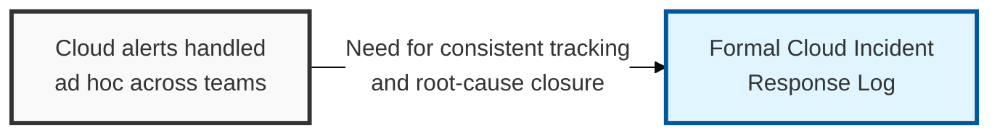
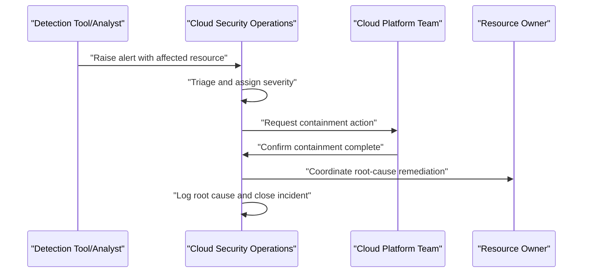

## I. Overview

**Definition**: A Cloud Incident Response Log is the chronological record of security incidents detected in cloud environments — exposed storage, compromised credentials, misused service accounts, or compromised workloads — tracked from detection through containment, root cause, and remediation.

**Features**:  
( **Ownership** ) Owned by the cloud security operations team, with input from the platform team on containment actions and from resource owners on impact.  
( **Cross-Tool Consolidation** ) Consolidates incidents that often span multiple accounts, providers, and detection tools (CSPM, CWPP, cloud-native audit logs) into a single log.  
( **Pattern Visibility** ) Lets a security program see patterns and measure response time across incidents.  
( **Verified Closure** ) Proves an incident was actually closed rather than just alerted on.

## II. Structure & Process

| Field | Description |
|---|---|
| Incident ID | Unique identifier for tracking and cross-referencing. |
| Detection Source | CSPM/CWPP/CNAPP alert, cloud audit trail, or user report. |
| Affected Account/Resource | The specific cloud account, service, or resource involved. |
| Severity | Impact classification, e.g. critical, high, medium, low. |
| Detection Time | Timestamp the incident was first flagged. |
| Containment Actions | Immediate steps taken to limit exposure. |
| Root Cause | Underlying configuration, credential, or process failure identified. |
| Remediation | Fix applied and verification that it holds. |
| Closure Date | When the incident was formally closed. |

Every alert that reaches triage gets a log entry regardless of eventual severity, and the log is only closed once containment, root cause, and remediation are all recorded — with a post-incident review feeding lessons learned back into the configuration baseline.

## III. Expected Benefits & Implications

A well-kept incident log's real payoff shows up months later, not during the incident itself — it's the only place a security program can prove, to an auditor or a board, that alerts were actually triaged and closed rather than accumulating in a dashboard nobody reopens. Logging every triaged alert, including the ones that turn out benign, is what makes mean-time-to-detect and mean-time-to-remediate honest program metrics instead of numbers cherry-picked from the incidents that made headlines.

| Benefit | Where It Shows Up |
|---|---|
| Defensible audit trail | Root cause and remediation evidence recorded per incident |
| Program-level trend visibility | MTTD/MTTR tracked across incidents, not just per case |
| Fewer repeat misconfigurations | Root causes fed back into the configuration baseline |

The habit that separates a mature program from one just going through the motions is closing that last loop back to the baseline — an incident whose root cause never becomes a new baseline control is simply a rehearsal for the same incident recurring.

Related: [Cloud Security Configuration Baseline](../cloud-security-configuration-baseline/), [Cloud Backup & Recovery Testing Tracker](../cloud-backup-recovery-testing-tracker/).
