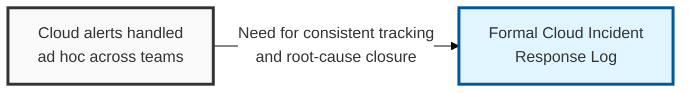
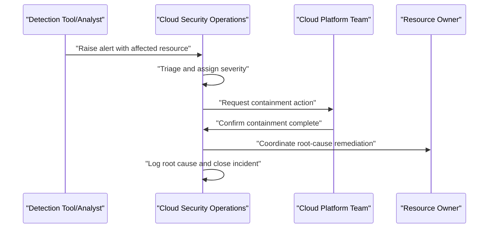

## I. Overview

**Definition**: A Cloud Incident Response Log is the chronological record of security incidents detected in cloud environments — exposed storage, compromised credentials, misused service accounts, or compromised workloads — tracked from detection through containment, root cause, and remediation.

**Features**:  
( **Ownership** ) Owned by the cloud security operations team, with input from the platform team on containment actions and from resource owners on impact.  
( **Cross-Tool Consolidation** ) Consolidates incidents that often span multiple accounts, providers, and detection tools (CSPM, CWPP, cloud-native audit logs) into a single log.  
( **Pattern Visibility** ) Lets a security program see patterns and measure response time across incidents.  
( **Verified Closure** ) Proves an incident was actually closed rather than just alerted on.

## II. Structure & Process

| Field | Description |
|---|---|
| Incident ID | Unique identifier for tracking and cross-referencing. |
| Detection Source | CSPM/CWPP/CNAPP alert, cloud audit trail, or user report. |
| Affected Account/Resource | The specific cloud account, service, or resource involved. |
| Severity | Impact classification, e.g. critical, high, medium, low. |
| Detection Time | Timestamp the incident was first flagged. |
| Containment Actions | Immediate steps taken to limit exposure. |
| Root Cause | Underlying configuration, credential, or process failure identified. |
| Remediation | Fix applied and verification that it holds. |
| Closure Date | When the incident was formally closed. |

Every alert that reaches triage gets a log entry regardless of eventual severity, and the log is only closed once containment, root cause, and remediation are all recorded — with a post-incident review feeding lessons learned back into the configuration baseline.

## III. Best Practices & Comparison

| Document | Primary Purpose | Update Cadence | Owner |
|---|---|---|---|
| Cloud Incident Response Log | Track cloud security incidents from detection to closure | Per incident | Cloud security operations |
| Cloud Security Configuration Baseline | Define the hardened settings incidents are measured against | Version-controlled, updated per provider changes | Cloud security architecture team |
| Cloud Backup & Recovery Testing Tracker | Verify recovery options if an incident requires restoration | Quarterly restore tests, continuous backup logging | Cloud platform/DR team |

- Log every triaged alert, not only confirmed incidents, to support trend and near-miss analysis.
- Tie root cause back to a specific control gap in the [Cloud Security Configuration Baseline](../cloud-security-configuration-baseline/) wherever possible.
- Integrate detection sources (CNAPP, CSPM, CWPP) so evidence capture and timestamps are automatic, not manually transcribed.
- Track mean time to detect and mean time to remediate as standing metrics, not one-off reporting.
- Feed closed incidents into baseline hardening reviews so the same misconfiguration cannot recur.

Related: [Cloud Security Configuration Baseline](../cloud-security-configuration-baseline/), [Cloud Backup & Recovery Testing Tracker](../cloud-backup-recovery-testing-tracker/).
