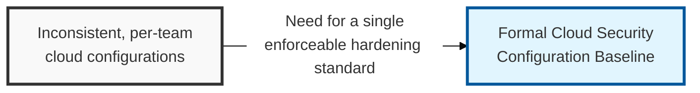
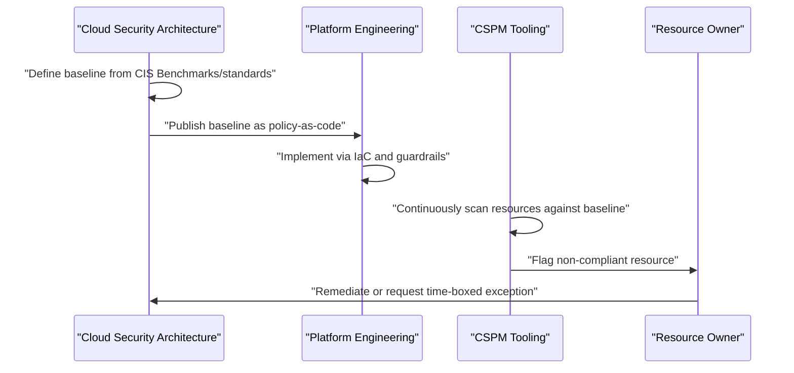

## I. Overview

**Definition**: A Cloud Security Configuration Baseline defines the approved secure settings — IAM policy limits, storage access defaults, network exposure rules, logging requirements — that every cloud resource of a given type must meet, expressed as controls a CSPM tool or policy engine can check automatically.

**Features**:  
( **Ownership** ) Owned by the cloud security architecture team and implemented jointly with platform engineering through infrastructure-as-code and policy-as-code.  
( **Drift Prevention** ) Counters how cloud configuration drifts fast when resources are cheap to create and self-service by design.  
( **Enforced Standard** ) Turns "secure by default" from an aspiration into an enforced, auditable standard.  
( **Recognized Derivation** ) Typically derived from recognized references such as CIS Benchmarks or provider well-architected frameworks.

## II. Structure & Process

| Field | Description |
|---|---|
| Service/Resource Type | The cloud service the control applies to, e.g. object storage, IAM, VPC. |
| Control ID | Unique identifier cross-referenced to the standard it derives from. |
| Setting/Requirement | The specific configuration required, e.g. public access blocked by default. |
| Standard Reference | Source standard, such as a CIS Benchmark or NIST control. |
| Enforcement Mechanism | How it is enforced, e.g. service control policy, policy-as-code, CSPM rule. |
| Compliance Status | Current scan result across the resource population. |
| Exception Process | How and for how long a documented deviation may be approved. |
| Last Reviewed | Date the control was last validated against provider changes. |

The baseline is version-controlled and reviewed whenever a provider introduces new services or changes default behavior, while individual resources are checked continuously by CSPM tooling rather than on a periodic audit cycle — exceptions are logged with an expiry date and revisited at each baseline review.

## III. Best Practices & Comparison

| Document | Primary Purpose | Update Cadence | Owner |
|---|---|---|---|
| Cloud Security Configuration Baseline | Define the hardened settings all cloud resources must meet | Version-controlled, updated per provider changes | Cloud security architecture team |
| Cloud Access Control Matrix | Track which identities can act on which resources | Continuous, with periodic recertification | Cloud security/IAM team |
| Cloud Asset Inventory Tracker | Track which resources exist to be checked against the baseline | Continuous, discovery-driven | Cloud platform team |

- Derive the baseline from a recognized standard, such as CIS Benchmarks, rather than writing controls from scratch.
- Enforce through policy-as-code and service control policies, not documentation teams are expected to remember.
- Treat every exception as time-boxed and tracked, never a silent permanent deviation.
- Version the baseline alongside provider service updates so new resource types are never left unscoped.
- Validate continuously with CSPM scanning instead of relying on periodic manual configuration review.

Related: [Cloud Access Control Matrix](../cloud-access-control-matrix/), [Cloud Asset Inventory Tracker](../cloud-asset-inventory-tracker/).
