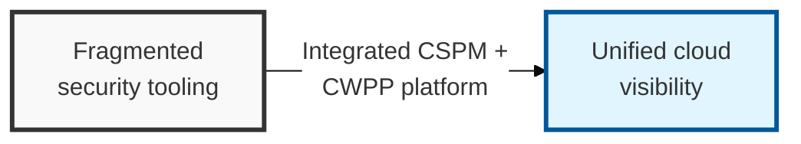

## I. Overview

**Definition**: CNAPP is a cloud-native security platform that unifies the configuration management of cloud assets, such as virtual machines, containers, and serverless functions (CSPM), with workload protection (CWPP) into a single system.

**Features**:  
( **Resolving Fragmentation** ) Integrates individual solutions such as CSPM and CWPP to eliminate security blind spots and reduce management complexity.  
( **Enhanced Correlation** ) Combines analysis of infrastructure configuration and workload threats to prioritize protection of assets with genuinely high risk.  
( **Lifecycle Protection** ) Provides security visibility across the entire cloud lifecycle, from development (artifact scanning) to operations (runtime).

## II. Mechanism & Components

### A. The Three Core Technical Components of CNAPP

- **CSPM** (Configuration Management): Detects misconfigurations in cloud infrastructure and monitors compliance
- **CWPP** (Workload Protection): Defends against vulnerabilities and detects anomalous behavior in running containers and VMs
- **CI / CD Security** (Artifact Scanning): Identifies security weaknesses early in source code (SAST), open-source components (SCA), and IaC configuration files

### B. Key Features and Strengths of CNAPP

| Feature Area | Details | Expected Effect |
|:---:|----------|----------|
| **Full Lifecycle** Integration | Connects development-stage scanning with operations-stage runtime security | Eliminates security blind spots |
| Risk Prioritization | Correlates misconfigurations with vulnerabilities to identify real threats | Increases security operations efficiency (risk scoring) |
| **Agentless** Scanning | Snapshot-based analysis minimizes impact on workload performance | Enables flexible scalability and operational convenience |
| Unified Visibility | Provides a consolidated dashboard for multi-cloud and hybrid-cloud assets | Strengthens governance and speeds up decision-making |

## III. Outlook & Future Direction

| Tool Category | Status | Direction |
|---|---|---|
| Standalone CSPM / CWPP | Mature, increasingly commoditized | Being absorbed as platform modules |
| CI/CD artifact scanning | Maturing, still fragmented by ecosystem | Consolidating into platform-native scanning |
| CNAPP (unified) | Consolidating market, uneven module maturity | Becoming the default RFP category |

CNAPP isn't really a new detection technology — it's the market correcting for the integration tax of buying CSPM, CWPP, and CI/CD scanning as separate products with separate dashboards and no shared risk context. The near-term risk for buyers isn't whether to consolidate — that direction is already set — it's vendors who bolted acquired point products together under one brand without unifying the underlying data model. Ask for the actual risk-scoring logic behind the dashboard, not just the combined UI, before treating "CNAPP" as a solved checkbox.
