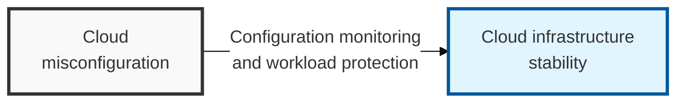

## I. Overview

**Definition**: An integrated security framework combining CSPM, which checks cloud infrastructure for configuration errors, and CWPP, which protects workloads such as virtual machines (VMs) and containers.

**Features**:  
( **Preventing Misconfiguration** ) Continuous monitoring is needed to prevent data breaches caused by cloud misconfigurations.  
( **Workload Protection** ) Requires real-time threat response for dynamic cloud execution environments such as containers and serverless functions.  
( **Compliance Response** ) Requires ongoing verification of technical security standards and regulatory compliance for dynamic cloud assets.

## II. Mechanism & Components

### A. Characteristics of CSPM (Cloud Security Posture Management)

**Core Functions**:
- **Configuration Monitoring**: Continuously checks for open storage (e.g. S3 buckets) and misuse of IAM permissions
- **Compliance Assurance**: Automatically evaluates compliance with standards and guidelines such as ISMS-P, NIST, and CIS Benchmarks
- **Asset Identification**: Automatically detects unmanaged "shadow cloud" assets and provides visibility into them

### B. Characteristics of CWPP (Cloud Workload Protection Platform)

**Core Functions**:
- **Vulnerability Management**: Scans running workloads (VMs, containers, serverless functions) for OS and application vulnerabilities
- **Runtime Protection**: Performs anomaly detection (EDR-like capability), anti-malware, and IPS functions
- **Micro-Segmentation**: Visualizes communication between workloads (east-west traffic) and applies fine-grained access control

## III. Advanced Topics & Comparison

### Detailed Comparison of CSPM and CWPP

| Comparison Item | CSPM (Configuration Management) | CWPP (Workload Protection) |
|----------|----------------|-------------------|
| Security Target | Control plane (infrastructure configuration, services) | Data plane (VMs, containers, applications) |
| Core Purpose | Preventing misconfiguration | Intrusion detection and vulnerability defense |
| Key Technology | API-based scanning, policy engine | Agent-based or sidecar approach |
| Managed By | Cloud administrators, security operators | Security operators, developers (DevOps) |
| Relationship | Hardens the **"outside"** (perimeter security) | Hardens the **"inside"** (host security) |
