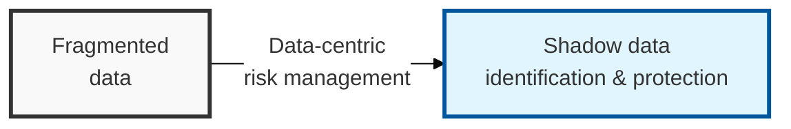

## I. Overview

**Definition**: A security technology that automatically discovers the location of structured and unstructured data within cloud infrastructure and provides visibility by analyzing the data's sensitivity and security risk.

**Features**:  
( **Shadow Data Identification** ) Automatically detects hidden data assets — such as copies and test databases — that fall outside IT department control.  
( **Sensitivity-Based Protection** ) Classifies data itself by sensitivity (e.g. personal information) and applies differentiated security based on importance.  
( **Compliance Evidence** ) Provides ongoing visibility to meet strengthened data protection regulations such as GDPR and ISMS-P.

## II. Mechanism & Components

### A. The Four Core Processes of DSPM

- **Data Discovery**: Automatically identifies data assets not only in managed databases but also in object storage (e.g. S3) and unstructured data
- **Data Classification**: Uses AI/ML technology to classify the sensitivity of data such as personal information, financial information, and corporate secrets
- **Risk Assessment**: Calculates risk by analyzing who can access the data, its exposure paths (e.g. internet exposure), and whether it is encrypted
- **Continuous Monitoring and Remediation**: Tracks the data's movement path (lineage) and automatically alerts and responds when misconfigurations occur

### B. Technical Strengths of DSPM

| Category | Details | Characteristics and Advantages |
|------|----------|------------|
| **Data-Centric** | Focuses on the **"data itself,"** not infrastructure configuration | Enables prioritized response based on data importance |
| **Agentless** | Analysis based on cloud APIs and snapshots | Zero performance overhead on production environments and fast deployment |
| **Shadow Data** Detection | Identifies copies and test databases unknown to the IT department | Eliminates security blind spots caused by neglected data |
| **Contextual Analysis** | Combines infrastructure configuration (CSPM) with data sensitivity | Focuses management on assets with genuinely high exposure risk |

## III. Advanced Topics & Comparison

### DSPM vs. Traditional Security Solutions (DLP, CSPM)

| Comparison Item | Traditional DLP (Data Loss Prevention) | CSPM (Posture Management) | DSPM (Data Posture) |
|----------|-------------------------------|---------------------------|---------------------|
| **Security Focus** | Blocking data exfiltration actions | Infrastructure / service misconfiguration | Data existence and risk management |
| **Primary Target** | Endpoints, network perimeter | Cloud resources (S3, EC2, etc.) | Data assets (databases, files, etc.) |
| **Operating Method** | Rule-based (regex) real-time monitoring | API-based configuration checks | Scan-based data analysis |
| **Core Value** | Prevention of leakage | Compliance assurance | Data visibility and governance |
