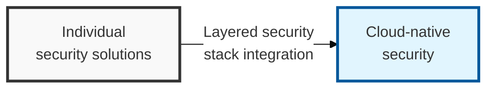
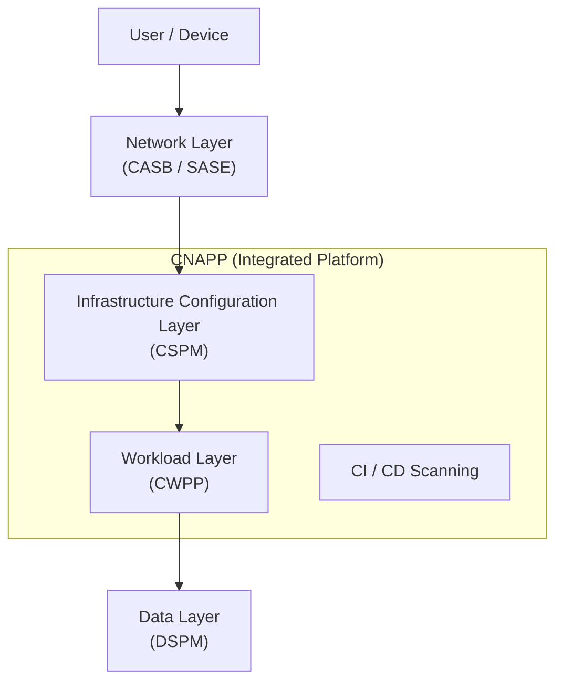

## I. Overview

**Definition**: A defense-in-depth framework spanning cloud service configuration (control plane), actual data processing (data plane), and user access points.

**Features**:  
( **Unified Visibility** ) Combines fragmented security solutions into a single architecture to gain visibility across the entire cloud estate.  
( **Data-Centric Security** ) A risk management framework focused on the "data itself" that must be protected, rather than infrastructure or the network.  
( **Automated Response** ) Maximizes the efficiency and speed of security operations through policy-based real-time monitoring and automated remediation.

## II. Mechanism & Components

### A. Conceptual Diagram of the Integrated Cloud Security Architecture

### B. Key Solutions and Roles by Layer

| Security Layer | Core Solution | Primary Role and Placement |
|:---:|:---:|-----------|
| User & Access | **CASB** / **SASE** | Controls SaaS usage and provides visibility between the user and the cloud (in-line / API) |
| Control Plane | **CSPM** | Detects misconfigurations in cloud infrastructure (IAM, S3, network) and enforces governance |
| Data Layer | **DSPM** | Discovers structured and unstructured data in the cloud, classifies sensitivity, and manages data risk |
| Workload Layer | **CWPP** | Detects malware and protects running processes inside VMs, containers, and serverless functions |
| Full Lifecycle | **CNAPP** | Integrates the solutions above into one platform, protecting from build to run |

## III. Advanced Topics & Comparison

### Interaction and Data Flow Between Solutions

- **Context** correlation: Combines the "internet-exposed configurations" found by **CSPM** with the "vulnerabilities" found by **CWPP** to prioritize assets with genuinely high attack likelihood
- **Data-Centric** linkage: Implements risk-based security in which **CSPM** and **CWPP** intensively monitor the resources identified by **DSPM** as holding "sensitive data"
- **Shift-Left** integration: Forms a feedback loop in which results scanned within the CI/CD pipeline are automatically reflected into operational-stage security policy (**CNAPP**)

### Strategies for Strengthening the Integrated Architecture

| Category | Primary Response Strategy | Core Expected Effect |
|:---:|--------------|--------------|
| Unified Visibility | Build a single pane of glass dashboard | Eliminates security blind spots and reduces alert fatigue |
| Automated Remediation | Policy-based automatic correction when misconfigurations occur | Shortens incident response time (MTTR) and minimizes human error |
| Zero Trust | Apply continuous authentication and least privilege to every connection | Prevents account takeover and lateral movement |
