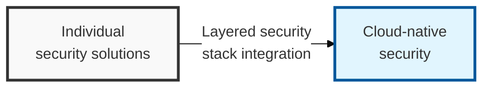
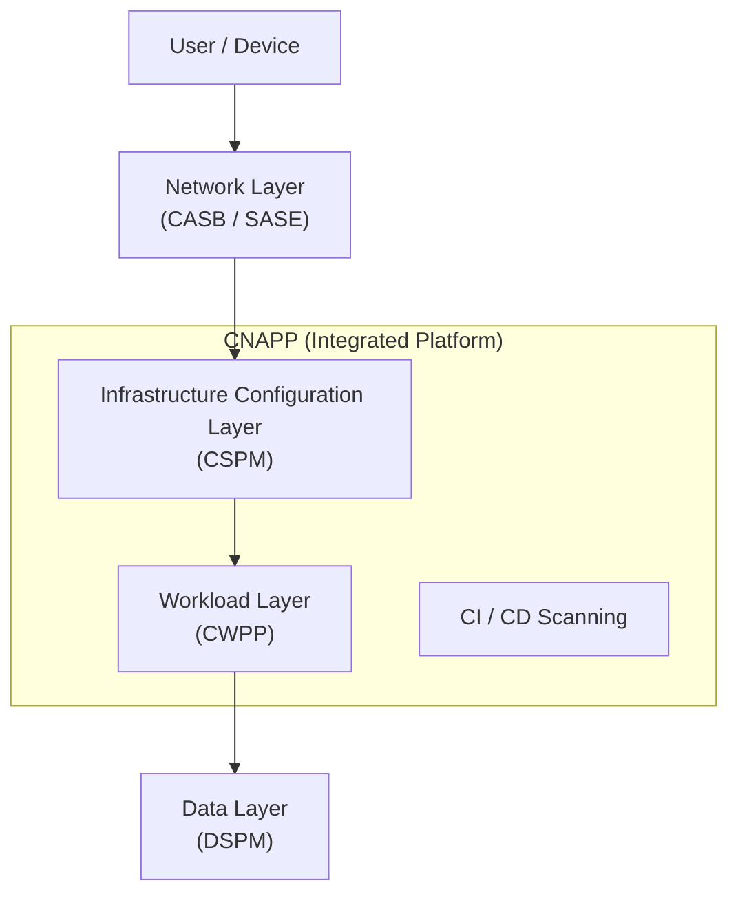

## I. Overview

**Definition**: A defense-in-depth framework spanning cloud service configuration (control plane), actual data processing (data plane), and user access points.

**Features**:  
( **Unified Visibility** ) Combines fragmented security solutions into a single architecture to gain visibility across the entire cloud estate.  
( **Data-Centric Security** ) A risk management framework focused on the "data itself" that must be protected, rather than infrastructure or the network.  
( **Automated Response** ) Maximizes the efficiency and speed of security operations through policy-based real-time monitoring and automated remediation.

## II. Mechanism & Components

### A. Conceptual Diagram of the Integrated Cloud Security Architecture

### B. Key Solutions and Roles by Layer

| Security Layer | Core Solution | Primary Role and Placement |
|:---:|:---:|-----------|
| User & Access | **CASB** / **SASE** | Controls SaaS usage and provides visibility between the user and the cloud (in-line / API) |
| Control Plane | **CSPM** | Detects misconfigurations in cloud infrastructure (IAM, S3, network) and enforces governance |
| Data Layer | **DSPM** | Discovers structured and unstructured data in the cloud, classifies sensitivity, and manages data risk |
| Workload Layer | **CWPP** | Detects malware and protects running processes inside VMs, containers, and serverless functions |
| Full Lifecycle | **CNAPP** | Integrates the solutions above into one platform, protecting from build to run |

## III. Expected Benefits & Implications

The payoff of layering CASB, CSPM, CWPP, and DSPM into one architecture instead of running them as unrelated purchases is correlation, not just coverage. Each tool already covers its own layer reasonably well in isolation; stacking them lets a CSPM-flagged public-facing resource get automatically escalated the moment DSPM confirms it holds regulated data, instead of sitting in a queue behind a thousand misconfigurations of equal apparent severity.

| Benefit | Where It Shows Up |
|---|---|
| Fewer false-priority alerts | Context correlation across CSPM, CWPP, and DSPM findings |
| Shorter MTTR | Policy-based automated remediation instead of manual triage |
| Reduced lateral-movement risk | Zero Trust applied at every layer boundary, not only the perimeter |

The implication most organizations underestimate is organizational rather than technical: a single-pane dashboard only delivers the efficiency it promises if the teams owning each layer agree on one shared severity model — otherwise "unified visibility" just means four teams staring at the same alert and still arguing over whose problem it is.
