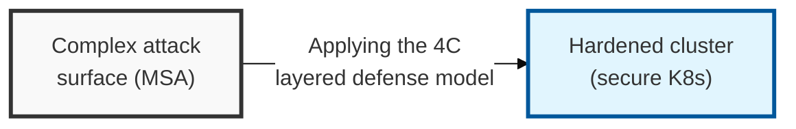
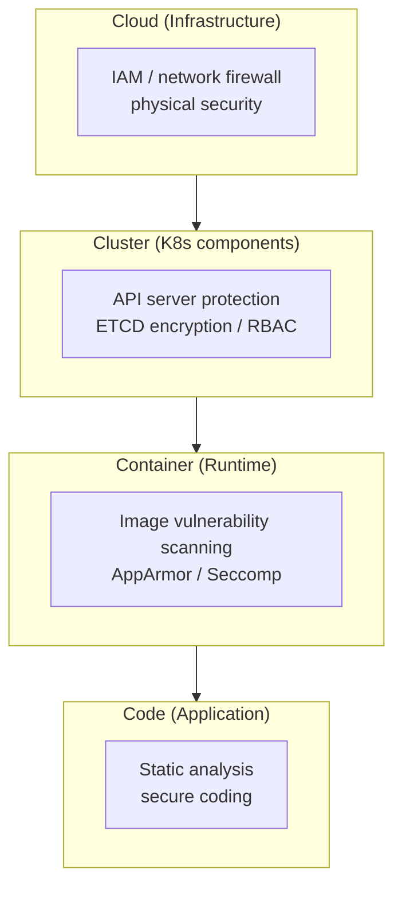
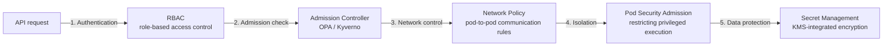

## I. Overview

**Definition**: A multi-faceted set of security mechanisms that protects cluster components (the **control plane**) and workloads (**worker nodes**) in a container orchestration environment from external threats and internal misconfiguration.

**Features**:  
( **Growing Attack Surface** ) The spread of microservices architecture (**MSA**) increases the number of complex communication paths and exposure points.  
( **Defending Against Lateral Movement** ) Once a container is compromised, blocking its spread to neighboring containers or hosts (**lateral movement**) is essential.  
( **Preventing Misconfiguration** ) Weak security in declarative configuration (**YAML**) can lead to permission abuse and data leakage incidents that must be prevented.

## II. Mechanism & Components

### A. The 4C Security Layer Model and Threat Factors

> **Key point**: In the 4C model, each outer layer (Cloud) forms the security foundation of the layer inside it (down to Code) — a dependent structure in which hardening only the inner layers cannot save the whole system if an outer layer remains vulnerable.

### B. Five Core Technologies for Strengthening Kubernetes Security

| Category | Key Technology | Details | Security Value |
|-----|---------|---------|-----------|
| Authentication/Authorization | RBAC (Role-Based Access Control) | Grants differentiated API access permissions based on role | Implements the principle of least privilege |
| Network | Network Policy | Sets rules to allow/block communication between pods | L3/L4 micro-segmentation |
| Compliance | Admission Controller | Verifies that newly created resources comply with policy | Enforces security configuration (e.g. OPA) |
| Isolation | Pod Security Admission | Restricts privileged execution and defines isolation levels | Prevents container escape |
| Data Protection | Secret Management | Encrypts and stores sensitive information such as API keys and certificates | Prevents credential leakage (KMS integration) |

## III. Outlook & Future Direction

| Practice | Status | Direction |
|---|---|---|
| RBAC + Network Policy | Baseline, widely adopted | Table stakes for any production cluster |
| Admission control (OPA/Kyverno) | Maturing, still inconsistently enforced | Moving from bolt-on to default-on cluster policy |
| Service mesh mTLS (Istio/Linkerd) | Available, adoption lags awareness | Increasingly required wherever encryption-in-transit is mandated |
| External secret management (Vault/KMS) | Mature pattern, still under-adopted | Becoming the default over built-in Secret objects |

Kubernetes' out-of-the-box defaults are still "allow-all" at the network layer and Base64-only (not encrypted) for Secrets — both exist for developer convenience, and a maturity assessment should treat both as failing conditions rather than acceptable starting points. The direction worth betting on is admission control shifting from something bolted on after an incident (installing OPA Gatekeeper post-mortem) to a cluster-provisioning requirement enforced before the first workload ever deploys. Any cluster without validating admission control and external secret management wired in from day one should be treated as pre-production, regardless of what's actually running on it.
