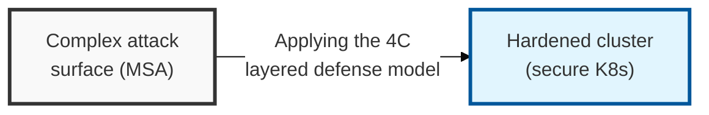
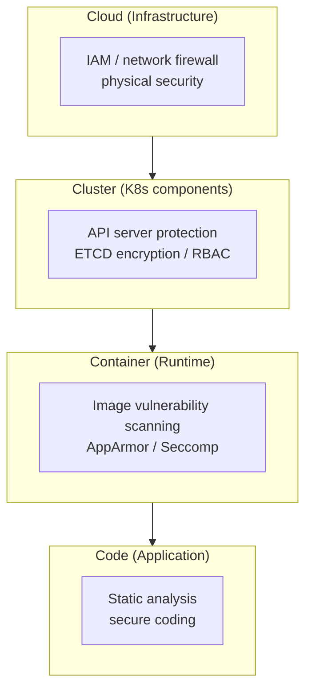
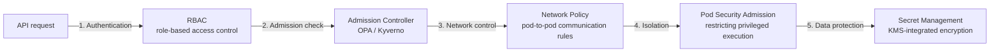
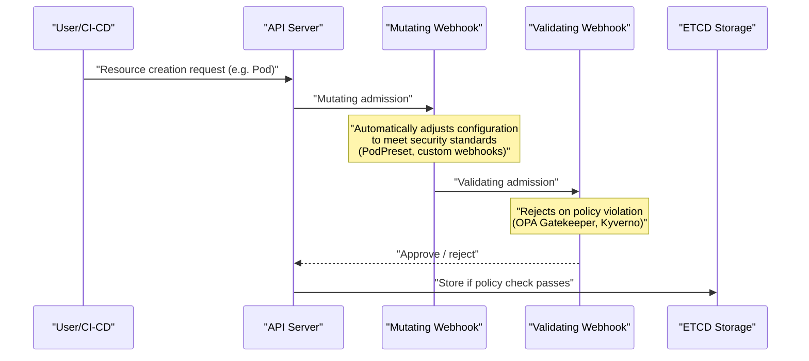
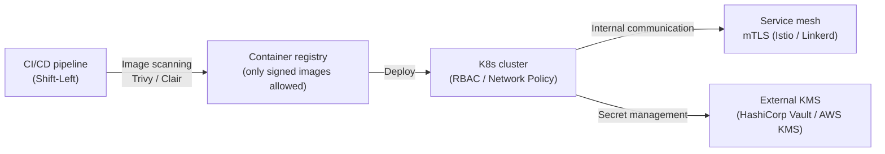

## I. Overview

**Definition**: A multi-faceted set of security mechanisms that protects cluster components (the **control plane**) and workloads (**worker nodes**) in a container orchestration environment from external threats and internal misconfiguration.

**Features**:  
( **Growing Attack Surface** ) The spread of microservices architecture (**MSA**) increases the number of complex communication paths and exposure points.  
( **Defending Against Lateral Movement** ) Once a container is compromised, blocking its spread to neighboring containers or hosts (**lateral movement**) is essential.  
( **Preventing Misconfiguration** ) Weak security in declarative configuration (**YAML**) can lead to permission abuse and data leakage incidents that must be prevented.

## II. Mechanism & Components

### A. The 4C Security Layer Model and Threat Factors

> **Key point**: In the 4C model, each outer layer (Cloud) forms the security foundation of the layer inside it (down to Code) — a dependent structure in which hardening only the inner layers cannot save the whole system if an outer layer remains vulnerable.

### B. Five Core Technologies for Strengthening Kubernetes Security

| Category | Key Technology | Details | Security Value |
|-----|---------|---------|-----------|
| Authentication/Authorization | RBAC (Role-Based Access Control) | Grants differentiated API access permissions based on role | Implements the principle of least privilege |
| Network | Network Policy | Sets rules to allow/block communication between pods | L3/L4 micro-segmentation |
| Compliance | Admission Controller | Verifies that newly created resources comply with policy | Enforces security configuration (e.g. OPA) |
| Isolation | Pod Security Admission | Restricts privileged execution and defines isolation levels | Prevents container escape |
| Data Protection | Secret Management | Encrypts and stores sensitive information such as API keys and certificates | Prevents credential leakage (KMS integration) |

## III. Advanced Topics & Comparison

### Admission Control Flow for Supply Chain Security

| Stage | Role | Key Tools |
|-----|------|---------|
| Mutating | Automatically adjusts requested resource configuration to meet security standards | PodPreset, custom webhooks |
| Validating | Rejects creation on violation of security policy (e.g. non-root account enforcement) | OPA Gatekeeper, Kyverno |

### Key Considerations for Practical Application

**The Limits of Secrets and External Integration**: Kubernetes' built-in Secret objects are stored as Base64-encoded values, which is weak from a security standpoint — in practice they should be managed by integrating with HashiCorp Vault or a cloud provider's KMS (AWS/Azure).

**Shift-Left Security**: Detection during operations matters, but performing image vulnerability scanning (Trivy, Clair) and IaC (Terraform, YAML) security checks earlier in the CI/CD pipeline — a Shift-Left strategy — is essential.

**Zero Trust Networking**: Communication within a cluster is allowed by default (allow-all), so mutual authentication and fine-grained traffic control based on mTLS (Mutual TLS) via a service mesh (Istio, Linkerd) must be layered on top.

