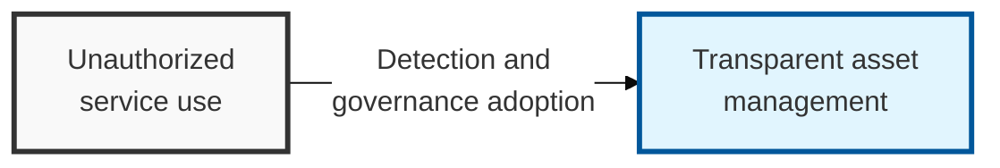

## I. Overview

**Definition**: Information assets and services used for business purposes that violate an organization's information security policy or bypass its formal asset management process.

**Features**:  
( **Reduced Security Visibility** ) Falls outside the organization's formal asset management framework, making it impossible for the security team to monitor or control.  
( **Data Leakage Path** ) Poses a persistent risk of sensitive corporate information leaking externally through personal cloud storage or collaboration tools.  
( **Compliance Violation** ) Using services that have not received security certification can result in violations of legal and regulatory compliance requirements.

## II. Mechanism & Components

### A. Major Risk Types of Shadow IT

- **Data Leakage**: Leakage of corporate confidential information through personal cloud storage (Dropbox, Google Drive, etc.)
- **Compliance Violation**: Processing of data containing personal information on external services that have not received security certification
- **Security Vulnerabilities**: Use of legacy equipment lacking security patches or free collaboration tools with weak security features

### B. Technical Detection and Management Approaches

| Management Technology | Details | Notes |
|----------|---------|------|
| **CASB** | Provides visibility into cloud service usage and applies security policy | Optimized for SaaS management |
| **DLP** | Blocks sensitive data from leaking through unauthorized channels in real time | Data-centric control |
| **NGFW** / **SWG** | Detects unauthorized application traffic at the network gateway | Protocol-based identification |
| **EASM** | Automatically identifies externally exposed assets (attack surface) | External attack surface management |

## III. Adoption Considerations

| Approach | Strategic Direction | Where It Fits |
|---|---|---|
| Control-focused (block by default) | Prohibit unauthorized services outright | Regulated, air-gapped, or high-security environments (finance, defense) |
| Enable-focused (adopt by default) | Formally onboard a service once it clears security review | Startups and product teams where blocking kills velocity |

Outright blocking looks like the safer choice on paper, and in practice it's usually what manufactures the next round of Shadow IT — users don't stop needing the capability, they just find a way around the block that's now also invisible to the security team. The more durable strategy is a fast, well-publicized path to sanctioning a tool (CASB-backed review, a standard security questionnaire, a committed turnaround SLA), so that asking first actually becomes easier than asking forgiveness.
