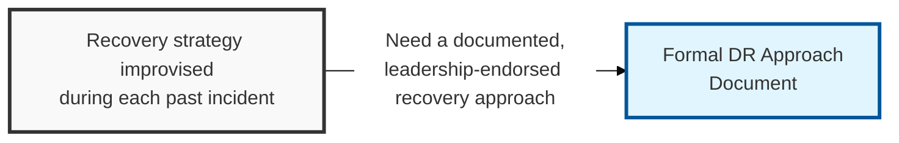
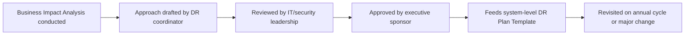

## I. Overview

**Definition**: A DR Approach Document is the strategic layer of disaster recovery: it states which systems are in scope, which recovery strategy tiers apply, the governance model, and the target bands for **RTO** (Recovery Time Objective) and **RPO** (Recovery Point Objective) before any system-level plan is written.

**Features**:  
( **Ownership** ) Drafted by the DR coordinator or business continuity manager and endorsed by IT and security leadership.  
( **Recovery Tiers** ) Defines strategy options such as hot site, warm site, cold site, or cloud-based DR.  
( **Funding Commitment** ) Endorsement commits the organization to a funding and resourcing model backing the chosen tiers.  
( **Consistency Risk** ) Without it, individual teams build recovery plans against inconsistent assumptions about downtime, data loss, and available infrastructure.

## II. Structure & Process

| Field | Description |
|---|---|
| Document Scope | Business units, sites, and system categories covered by the DR strategy. |
| Recovery Strategy Tiers | Defined options such as hot site, warm site, cold site, or cloud-based failover, and when each applies. |
| Critical System Categories | Tiering logic (e.g. Tier 1/2/3) used to prioritize which systems get which recovery strategy. |
| Governance & Roles | DR steering committee, DR coordinator, and escalation authority for declaring a disaster. |
| Funding/Resourcing Model | Budget and staffing commitment backing the chosen recovery tiers. |
| Target RTO/RPO Bands | Organization-wide recovery time and recovery point targets by tier, used as inputs to system-level plans. |
| Review Cadence | How often the approach is revisited relative to business and infrastructure change. |
| Executive Sponsor | Leadership role accountable for the strategy and its funding. |

## III. Outlook & Future Direction

| Recovery Tier | Status | Direction |
|---|---|---|
| Dedicated warm/hot site, standing capacity leased or owned | Legacy, capital-intensive | Being displaced in new approach documents |
| Cloud-based multi-region failover | Growing default tier option | Metered cost, faster and cheaper to re-test |
| Cold site / backup restore only | Still viable for low-tier systems | Retained for cost-insensitive, high-RTO-tolerance workloads |

Cloud-based failover is quietly erasing the cost gap between "warm site" and "hot site" that used to force approach documents into a hard, once-a-year tradeoff — when standby capacity is metered rather than a standing lease, funding commitment stops being about how much capacity to buy and becomes about how often the organization is willing to pay to actually prove failover works. The approach document's real leverage going forward is less in which tier it names and more in whether it mandates a testing cadence the funding model can sustain.

Related: [DR Plan Template](../dr-plan-template/), [DR Asset Register](../dr-asset-register/).
