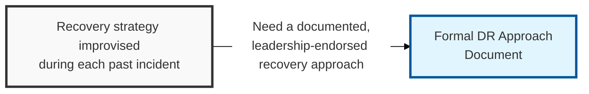

## I. Overview

**Definition**: A DR Approach Document is the strategic layer of disaster recovery: it states which systems are in scope, which recovery strategy tiers apply, the governance model, and the target bands for **RTO** (Recovery Time Objective) and **RPO** (Recovery Point Objective) before any system-level plan is written.

**Features**:  
( **Ownership** ) Drafted by the DR coordinator or business continuity manager and endorsed by IT and security leadership.  
( **Recovery Tiers** ) Defines strategy options such as hot site, warm site, cold site, or cloud-based DR.  
( **Funding Commitment** ) Endorsement commits the organization to a funding and resourcing model backing the chosen tiers.  
( **Consistency Risk** ) Without it, individual teams build recovery plans against inconsistent assumptions about downtime, data loss, and available infrastructure.

## II. Structure & Process

| Field | Description |
|---|---|
| Document Scope | Business units, sites, and system categories covered by the DR strategy. |
| Recovery Strategy Tiers | Defined options such as hot site, warm site, cold site, or cloud-based failover, and when each applies. |
| Critical System Categories | Tiering logic (e.g. Tier 1/2/3) used to prioritize which systems get which recovery strategy. |
| Governance & Roles | DR steering committee, DR coordinator, and escalation authority for declaring a disaster. |
| Funding/Resourcing Model | Budget and staffing commitment backing the chosen recovery tiers. |
| Target RTO/RPO Bands | Organization-wide recovery time and recovery point targets by tier, used as inputs to system-level plans. |
| Review Cadence | How often the approach is revisited relative to business and infrastructure change. |
| Executive Sponsor | Leadership role accountable for the strategy and its funding. |

## III. Best Practices & Comparison

| Document | Primary Purpose | When Used | Owner |
|---|---|---|---|
| DR Approach Document | Set strategy, scope, and recovery tiers | Before detailed planning; revisited annually | DR coordinator, IT/security leadership |
| DR Plan Template | Provide step-by-step recovery procedures per system | Built after the approach is approved; invoked during a disaster | System/application owners, DR coordinator |
| DR Asset Register | Inventory systems and their recovery priority | Continuously maintained; referenced by both documents above | IT infrastructure/asset management |

- Anchor recovery tiers to business impact analysis output, not to whichever infrastructure is easiest to stand up.
- Get executive sign-off in writing — the approach commits real budget to standby capacity.
- Revisit the approach whenever the organization adds a new critical system category or changes cloud providers.
- Keep the approach at strategy level; push procedural detail into the DR Plan Template so the approach stays stable.

Related: [DR Plan Template](../dr-plan-template/), [DR Asset Register](../dr-asset-register/).
