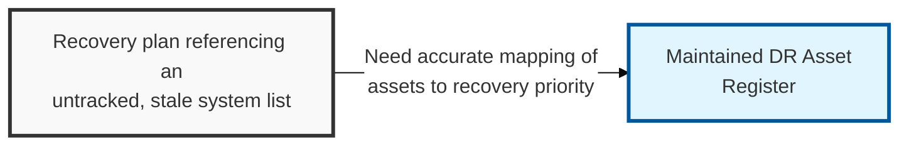
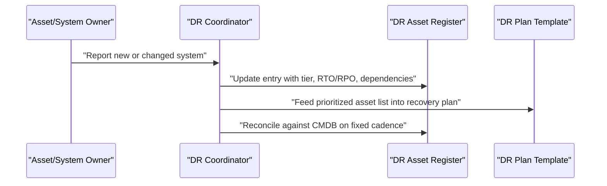

## I. Overview

**Definition**: A DR Asset Register is the current, validated inventory of every system, application, and piece of infrastructure in scope for disaster recovery, mapped to its business owner, dependencies, criticality tier, and per-asset **RTO**/**RPO** targets.

**Features**:  
( **Ownership** ) Maintained by the IT infrastructure or asset management team in coordination with the DR coordinator.  
( **Foundational Role** ) Serves as the factual foundation every DR plan is sequenced against.  
( **Sequencing Risk** ) A DR plan built on a stale asset list recovers systems in the wrong order or misses undocumented dependencies.  
( **Data Integrity** ) A stale register can point recovery efforts at infrastructure that no longer exists.

## II. Structure & Process

| Field | Description |
|---|---|
| Asset/System Name | The application, database, or infrastructure component being tracked. |
| Business Owner | The individual or team accountable for the asset. |
| Criticality Tier | Recovery priority tier assigned per the DR Approach Document. |
| Dependencies | Upstream and downstream systems required for this asset to function. |
| Target RTO | Maximum acceptable downtime for this specific asset. |
| Target RPO | Maximum acceptable data loss for this specific asset. |
| Recovery Site/Method | Where and how the asset is restored (hot site, cloud failover, backup restore). |
| Last Validated Date | Date the entry was last confirmed accurate against the live environment. |

## III. Adoption Considerations

| Risk | Mitigation |
|---|---|
| Register drifts from actual infrastructure between scheduled audits | Reconcile on change-management triggers (provisioning, decommission), not a calendar-only audit |
| Dependencies left undocumented or partially recorded | Make the dependency field mandatory at asset creation, not an optional cleanup task |
| Asset carries no accountable business owner | Withhold criticality-tier sign-off until an owner is named |
| Entry past its review cadence still treated as reliable | Flag stale entries and exclude them from recovery sequencing until re-confirmed |

An annual audit cadence is the register's biggest lie — a register is only as current as the last change that actually got recorded in it, so the fix is tying updates to the change-management process that already touches every asset being stood up or torn down, rather than to a point-in-time review that's stale again within a quarter. If reconciliation only happens before an exercise, the register is being validated against itself, not against production.

Related: [DR Plan Template](../dr-plan-template/), [DR Approach Document](../dr-approach-document/). See also [Cloud Backup & Recovery Testing Tracker](/docs/cloud-security/cloud-backup-recovery-testing-tracker/) for cloud-specific restore validation.
