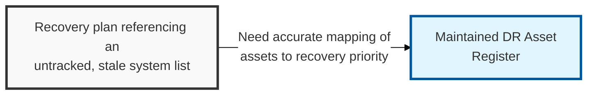
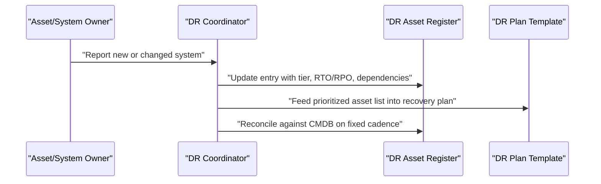

## I. Overview

**Definition**: A DR Asset Register is the current, validated inventory of every system, application, and piece of infrastructure in scope for disaster recovery, mapped to its business owner, dependencies, criticality tier, and per-asset **RTO**/**RPO** targets.

**Features**:  
( **Ownership** ) Maintained by the IT infrastructure or asset management team in coordination with the DR coordinator.  
( **Foundational Role** ) Serves as the factual foundation every DR plan is sequenced against.  
( **Sequencing Risk** ) A DR plan built on a stale asset list recovers systems in the wrong order or misses undocumented dependencies.  
( **Data Integrity** ) A stale register can point recovery efforts at infrastructure that no longer exists.

## II. Structure & Process

| Field | Description |
|---|---|
| Asset/System Name | The application, database, or infrastructure component being tracked. |
| Business Owner | The individual or team accountable for the asset. |
| Criticality Tier | Recovery priority tier assigned per the DR Approach Document. |
| Dependencies | Upstream and downstream systems required for this asset to function. |
| Target RTO | Maximum acceptable downtime for this specific asset. |
| Target RPO | Maximum acceptable data loss for this specific asset. |
| Recovery Site/Method | Where and how the asset is restored (hot site, cloud failover, backup restore). |
| Last Validated Date | Date the entry was last confirmed accurate against the live environment. |

## III. Best Practices & Comparison

| Document | Primary Purpose | When Used | Owner |
|---|---|---|---|
| DR Asset Register | Track which assets exist and their recovery priority | Continuously maintained, discovery-driven | IT infrastructure/asset management |
| DR Plan Template | Provide step-by-step recovery procedures per system | Built from register data; invoked during a disaster | System/application owners, DR coordinator |
| DR Approach Document | Define criticality tiers and recovery strategy options | Set once, revisited periodically | DR coordinator, IT/security leadership |

- Reconcile the register against the CMDB or cloud asset inventory on a fixed cadence, not only before an exercise.
- Record dependencies explicitly — a missed dependency is the most common cause of a failed recovery sequence.
- Assign every asset a business owner accountable for confirming its criticality tier and recovery targets.
- Treat an unvalidated entry older than the review cadence as untrustworthy until re-confirmed.

Related: [DR Plan Template](../dr-plan-template/), [DR Approach Document](../dr-approach-document/). See also [Cloud Backup & Recovery Testing Tracker](/docs/cloud-security/cloud-backup-recovery-testing-tracker/) for cloud-specific restore validation.
