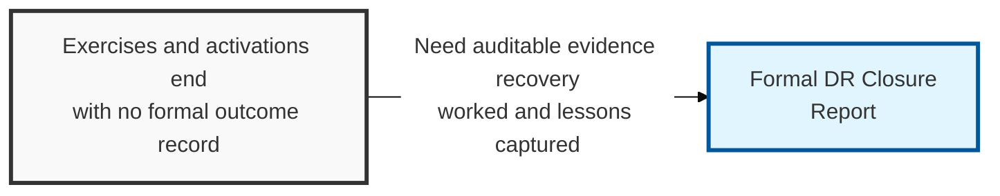
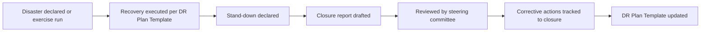

## I. Overview

**Definition**: A DR Closure Report is produced after a disaster recovery exercise or a real disaster activation is stood down, documenting what was actually recovered, the actual **RTO** and **RPO** achieved against target, gaps encountered, and the corrective actions assigned to close them.

**Features**:  
( **Ownership** ) Drafted by the DR coordinator and reviewed by the business continuity steering committee.  
( **Auditability** ) Without it, exercises and real activations leave no auditable record of whether the DR program actually works.  
( **Gap Recurrence** ) A missing closure report lets the same gaps resurface at the next event.  
( **Corrective Tracking** ) Ties measured RTO/RPO outcomes to assigned corrective actions and owners.

## II. Structure & Process

| Field | Description |
|---|---|
| Event/Exercise Reference | Identifier linking the report to the specific activation or exercise. |
| Activation Trigger | What declared the disaster or initiated the exercise. |
| Actual RTO Achieved | Measured recovery time compared against the target from the DR Plan Template. |
| Actual RPO Achieved | Measured data loss compared against the target. |
| Issues/Gaps Identified | Procedural, technical, or communication failures observed during recovery. |
| Corrective Actions | Remediation items raised to close each identified gap. |
| Action Owner & Due Date | Individual accountable for each corrective action and its deadline. |
| Sign-off/Approval | Steering committee or leadership approval closing the event. |

## III. Comparison & Application

| Document | Answers | Read When |
|---|---|---|
| DR Plan Template | How do we execute the recovery | During the event, and during pre-event testing |
| DR Communications Plan | Who tells whom, and when | During the event, in parallel with execution |
| DR Closure Report | Did it actually work, and what needs to change | After stand-down, before the next exercise is scheduled |

The closure report is the only one of the three graded against reality instead of intention — the plan and the comms protocol describe what was supposed to happen, while the closure report records what actually did. That makes a closure report with zero gaps and no corrective actions a warning sign rather than a good outcome: it more often means the exercise wasn't demanding enough to find anything than that the DR program has nothing left to fix.

Related: [DR Plan Template](../dr-plan-template/), [DR Communications Plan](../dr-comms-plan/). See also the [Incident Management](/docs/incident-management/) category for post-incident review practices.
