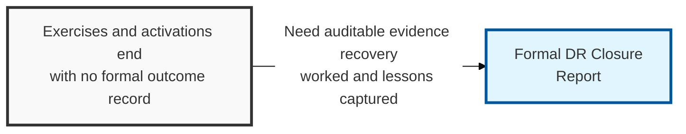
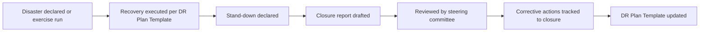

## I. Overview

**Definition**: A DR Closure Report is produced after a disaster recovery exercise or a real disaster activation is stood down, documenting what was actually recovered, the actual **RTO** and **RPO** achieved against target, gaps encountered, and the corrective actions assigned to close them.

**Features**:  
( **Ownership** ) Drafted by the DR coordinator and reviewed by the business continuity steering committee.  
( **Auditability** ) Without it, exercises and real activations leave no auditable record of whether the DR program actually works.  
( **Gap Recurrence** ) A missing closure report lets the same gaps resurface at the next event.  
( **Corrective Tracking** ) Ties measured RTO/RPO outcomes to assigned corrective actions and owners.

## II. Structure & Process

| Field | Description |
|---|---|
| Event/Exercise Reference | Identifier linking the report to the specific activation or exercise. |
| Activation Trigger | What declared the disaster or initiated the exercise. |
| Actual RTO Achieved | Measured recovery time compared against the target from the DR Plan Template. |
| Actual RPO Achieved | Measured data loss compared against the target. |
| Issues/Gaps Identified | Procedural, technical, or communication failures observed during recovery. |
| Corrective Actions | Remediation items raised to close each identified gap. |
| Action Owner & Due Date | Individual accountable for each corrective action and its deadline. |
| Sign-off/Approval | Steering committee or leadership approval closing the event. |

## III. Best Practices & Comparison

| Document | Primary Purpose | When Used | Owner |
|---|---|---|---|
| DR Closure Report | Record recovery outcomes and drive corrective action | After every exercise or real activation | DR coordinator, steering committee |
| DR Plan Template | Provide step-by-step recovery procedures per system | Built and tested before activation; executed during it | System/application owners, DR coordinator |
| DR Communications Plan | Coordinate stakeholder messaging during the event | Activated alongside the DR plan | DR coordinator, corporate communications |

- Write the closure report within days of stand-down, while details and timings are still fresh.
- Compare actual RTO/RPO against target explicitly — a recovery that "worked" but blew past target still needs a corrective action.
- Track every corrective action to closure and feed confirmed fixes back into the DR Plan Template.
- Treat exercise closure reports with the same rigor as real-activation reports; both are evidence the program is tested.

Related: [DR Plan Template](../dr-plan-template/), [DR Communications Plan](../dr-comms-plan/). See also the [Incident Management](/docs/incident-management/) category for post-incident review practices.
