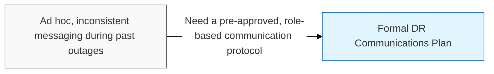
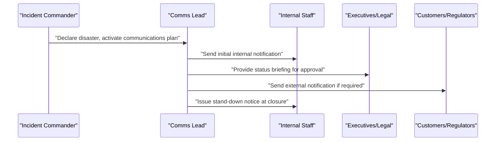

## I. Overview

A DR Communications Plan defines, in advance, who notifies which stakeholder group during a declared disaster, through which channel, using which pre-approved message templates, and under what escalation timing. It is owned by the DR coordinator working with corporate communications and legal, and it is exercised alongside the DR Plan Template. Without it, teams improvise messaging under pressure while racing against **RTO** targets, which produces inconsistent or premature statements to staff, customers, or regulators — a failure mode distinct from, but as damaging as, missing a recovery deadline.

## II. Structure & Process

| Field | Description |
|---|---|
| Stakeholder Group | Internal staff, executives, customers, regulators, or media. |
| Notification Trigger | The event or elapsed time that requires this group to be informed. |
| Channel | Email, SMS/paging, status page, press release, or direct call. |
| Message Template/Reference | Pre-approved wording or reference to the template library. |
| Responsible Communicator | Named role authorized to send the notification. |
| Approval Requirement | Whether legal or executive sign-off is required before sending. |
| Escalation Timing | Maximum time allowed between disaster declaration and first notification per group. |
| Regulatory/Legal Review Needed | Whether the event triggers mandatory disclosure obligations. |

## III. Best Practices & Comparison

| Document | Primary Purpose | When Used | Owner |
|---|---|---|---|
| DR Communications Plan | Coordinate stakeholder messaging during the event | Activated alongside the DR plan on declaration | DR coordinator, corporate communications |
| DR Plan Template | Provide step-by-step recovery procedures per system | Built and tested before activation; executed during it | System/application owners, DR coordinator |
| DR Closure Report | Record recovery outcomes and drive corrective action | After every exercise or real activation | DR coordinator, steering committee |

- Pre-draft and legally review message templates before an event, not during one.
- Name a single responsible communicator per stakeholder group to prevent conflicting statements.
- Set explicit escalation timing so notification delay doesn't compound the outage itself.
- Rehearse the communications plan in tabletop exercises alongside the technical recovery steps, not as an afterthought.

Related: [DR Plan Template](../dr-plan-template/), [DR Closure Report](../dr-closure-report/). See also the [Incident Management](/docs/incident-management/) category for broader stakeholder notification practices.
