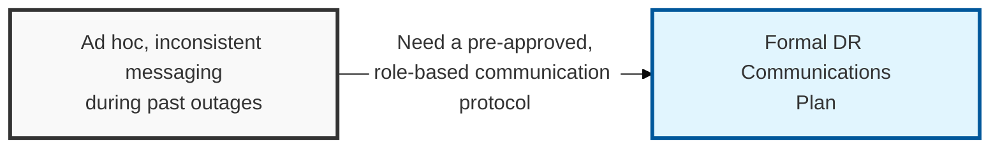
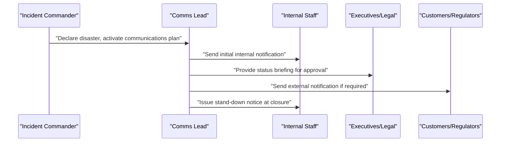

## I. Overview

**Definition**: A DR Communications Plan defines, in advance, who notifies which stakeholder group during a declared disaster, through which channel, using which pre-approved message templates, and under what escalation timing.

**Features**:  
( **Ownership** ) Owned by the DR coordinator working with corporate communications and legal, and exercised alongside the DR Plan Template.  
( **Distinct Failure Mode** ) Without it, teams improvise messaging under pressure while racing against **RTO** targets.  
( **Stakeholder Reach** ) Covers inconsistent or premature statements to staff, customers, or regulators.  
( **Comparable Damage** ) A messaging failure is a failure mode distinct from, but as damaging as, missing a recovery deadline.

## II. Structure & Process

| Field | Description |
|---|---|
| Stakeholder Group | Internal staff, executives, customers, regulators, or media. |
| Notification Trigger | The event or elapsed time that requires this group to be informed. |
| Channel | Email, SMS/paging, status page, press release, or direct call. |
| Message Template/Reference | Pre-approved wording or reference to the template library. |
| Responsible Communicator | Named role authorized to send the notification. |
| Approval Requirement | Whether legal or executive sign-off is required before sending. |
| Escalation Timing | Maximum time allowed between disaster declaration and first notification per group. |
| Regulatory/Legal Review Needed | Whether the event triggers mandatory disclosure obligations. |

## III. Vulnerabilities & Security Measures

| Risk | Mitigation |
|---|---|
| Primary channel (company Slack, internal wiki) runs on the infrastructure the disaster just took down | Designate an out-of-band channel — phone tree, externally hosted status page — as first-class, not a fallback |
| Legal/executive approval turns the first notification into a drafting exercise under time pressure | Pre-approve message wording per stakeholder group so approval on the day is a go/no-go, not a rewrite |
| Regulatory disclosure obligation isn't obvious in the moment | Decide the disclosure trigger in advance and attach it to activation criteria, not to judgment calls mid-event |

A communications plan that lists contacts only in the tool the disaster might itself have disabled has a single point of failure built into the plan meant to survive one. That gap almost never shows up in a document review — it surfaces the first time a tabletop exercise is run with the "primary" channel deliberately marked unavailable, which is exactly why that channel-down scenario belongs in the exercise script, not just in the plan's fine print.

Related: [DR Plan Template](../dr-plan-template/), [DR Closure Report](../dr-closure-report/). See also the [Incident Management](/docs/incident-management/) category for broader stakeholder notification practices.
