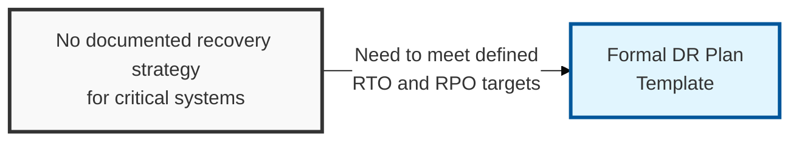
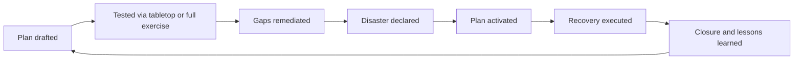

## I. Overview

**Definition**: A DR Plan Template is the operational runbook invoked once a disaster is declared: it lays out, per system or service, the recovery team, activation criteria, and the exact step-by-step procedure to restore operation within its target **RTO** (Recovery Time Objective) and **RPO** (Recovery Point Objective).

**Features**:  
( **Ownership** ) Drafted by the system or application owner in coordination with the DR coordinator.  
( **Source Material** ) Built from the DR Approach Document's strategy and the DR Asset Register's dependency data.  
( **Tested Artifact** ) The artifact actually tested in tabletop and full-failover exercises and executed during a real event.  
( **Beyond Strategy** ) A business cannot claim resilience on a strategy document alone — this is where that strategy becomes executable.

## II. Structure & Process

| Field | Description |
|---|---|
| System/Service in Scope | The application, database, or infrastructure component the plan covers. |
| Recovery Team & Roles | Named individuals or roles responsible for executing each recovery step. |
| Activation Criteria | Conditions under which this specific plan is invoked. |
| Step-by-Step Recovery Procedure | Ordered, executable instructions to restore the system. |
| Target RTO | Maximum acceptable downtime for this system. |
| Target RPO | Maximum acceptable data loss for this system. |
| Dependencies & Prerequisites | Upstream systems, credentials, or infrastructure that must be available first. |
| Test/Exercise History | Record of tabletop or full-failover exercises run against this plan and their outcomes. |

## III. Best Practices & Comparison

| Document | Primary Purpose | When Used | Owner |
|---|---|---|---|
| DR Plan Template | Provide step-by-step recovery procedures per system | Built and tested before activation; executed during it | System/application owners, DR coordinator |
| DR Approach Document | Set strategy, scope, and recovery tiers | Before detailed planning; revisited annually | DR coordinator, IT/security leadership |
| DR Closure Report | Record recovery outcomes and drive corrective action | After every exercise or real activation | DR coordinator, steering committee |

- Test every plan at least annually, and after any material change to the system it covers.
- Run tabletop exercises for lower-tier systems and full-failover tests for the highest-criticality tier.
- Keep recovery steps executable by someone other than the primary system owner — key-person dependency defeats the plan.
- Update the plan immediately from DR Closure Report findings rather than waiting for the next scheduled review.

Related: [DR Approach Document](../dr-approach-document/), [DR Asset Register](../dr-asset-register/), [DR Closure Report](../dr-closure-report/). See also [Cloud Backup & Recovery Testing Tracker](/docs/cloud-security/cloud-backup-recovery-testing-tracker/) for backup restore validation feeding this plan.
